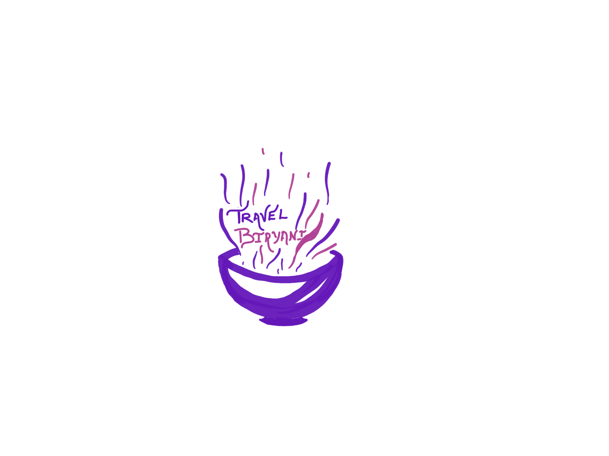

This page has details of text formatting used in Arabic Blog with examples.

**First Word**{: .firstword}

 

**Word**{: .word} <- This has to be deprecated

## H2 Tag
**Heading 1 Welcome to code blog. Enjoy the content. This is third Post**{: .heading1}  
**Heading 2 Welcome to code blog. Enjoy the content. This is third Post**{: .heading2}

### H3 Tag
**Heading 1 Welcome to code blog. Enjoy the content. This is third Post**{: .heading1}  
**Heading 2 Welcome to code blog. Enjoy the content. This is third Post**{: .heading2}

 

**Exception Welcome to code blog. Enjoy the content. This is third Post**{: .exception}

 

**Yellow background Welcome to code blog.**{: .bg-yellow}

 

**Cyan background Welcome to code blog.**{: .bg-cyan}

 

**Green background Welcome to code blog.**{: .bg-green}

 

> blockquote: Welcome to code blog.

 

`Code: Welcome to code blog. Enjoy the content. This is third Post`

 

> **عاصياً**{: .arabic .irab}
 منادى **منصوب**{: .irabhighlight} وعلامة نصبه الفتحة

 

> **زيد**{: .arabic .irab}
 منادى مبني على الضم في محل نصب

 

> What is this
- This is list
- this is item 2

 

|                        | Singular | Dual   | Plural  |
|------------------------|----------|--------|---------|
| Third Person (Male)    | كَتَبَ      | كَتَبَا   | كَتَبُوا   |
| Third Person (Female)  | كَتَبَتْ     | كَتَبَتَا  | كَتَبْنَ    |
| Second Person (Male)   | كَتَبْتَ     | كَتَبْتُمَا | كَتَبْتُمْ   |
| Second Person (Female) | كَتَبْتِ     | كَتَبْتُمَا | كَتَبْتُنَّ   |
| First Person           | كَتَبْتُ     |        | كَتَبْنَا   |

 

|                        | Singular | Dual   | Plural  |
|------------------------|----------|--------|---------|
| Third Person (Male)    | كَتَبَ      | كَتَبَا   | كَتَبُوا   |
| Third Person (Female)  | كَتَبَتْ     | كَتَبَتَا  | كَتَبْنَ    |
| Second Person (Male)   | كَتَبْتَ     | كَتَبْتُمَا | كَتَبْتُمْ   |
| Second Person (Female) | كَتَبْتِ     | كَتَبْتُمَا | كَتَبْتُنَّ   |

 

{:title="Travel Biryani"}

[this](/machine-learning){:title="Simple Linear Regression in Machine Learning" :target="_blank"}

External Link -> <a href="https://www.facebook.com/travelBiryani/" title="Travel Biryani Facebook" target="_blank" rel='external nofollow' >Facebook</a>