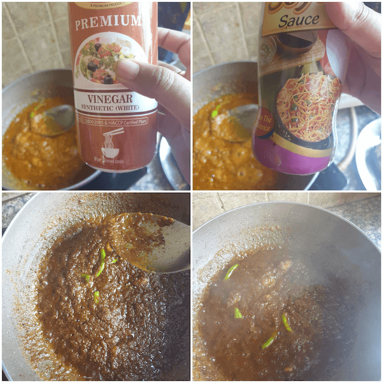

**Fish**{: .firstword} is an integral part of the Bengali Foodstyle and over time beautiful fish recipes have been born out of the Bengali's love for fish. Authentic Bengali fish curries were the result of experimentation for easily available and cheap sources of proteins in the entire undivided Bengal. 

 

Hilsa ( Tenulosa ilisha) fish is the most delicious of the sea's gift that a Bengali household is almost sure to enjoy every Hilsa season, which is mostly around the monsoon season when the Hilsa, a sea fish comes to major rivers like the Padma, Ganga , Brahmaputra, Hooghly to breed. 

 

The value of the fish is so great for a Bengali that it is presented to the groom on the wedding platter. Sea fish recipe is a much sought after recipe during the wedding season. The high demand and amazing taste of the fish makes it rather expensive but that does not deter people for enjoying it every once in a while. 

 

This recipe is one of the recipes that is my grandmum's fish curry , a very Indian style fish curry or rather a very authentic Bengali style fish curry, it is spicy and tangy best accompanied with a steaming plate of hot rice and a green chilli. Yum Yum! All my childhood memories come flooding back.

 

So let me share with you today a piece of my fondest childhood memory,the Bengali Vinegar Fish.

 
 

{:title="Fish Curry Cover"}

 
 

|    Division  | Time   |
|--------------|--------|
| Prep Time    | 30 mins |
| Cook Time    | 15 mins |

 

Serves 6

 

|                       | Ingredient           | Quantity                                                     |
|-----------------------|----------------------|--------------------------------------------------------------|
| &#10003; | Hilsa fish           | 1kg                                                          |
| &#10003; | Garlic paste         | 2 teaspoon                                                   |
| &#10003; | Onion Paste          | of 3 medium to large onions                                  |
| &#10003; | Black peppercorn     | 5                                                            |
| &#10003; | Mustard seeds        | 1/2 teaspoon                                                 |
| &#10003; | Whole green chillies | 6 slit in halves                                             |
| &#10003; | Red chilli powder    | 1/2 teaspoon                                                 |
| &#10003; | Mustard oil          | 2 tablespoons                                                |
| &#10003; | Turmeric powder      | 1/2 teaspoon                                                 |
| &#10003; | Coriander powder     | 1/2 teaspoon                                                 |
| &#10003; | Cumin powder         | 1/2 teaspoon                                                 |
| &#10003; | Vinegar              | 3 tablespoons (red vinegar is preferred over white vinegar)  |
| &#10003; | Soy Sauce            | 1 teaspoon                                                   |

 

**Method**{: .heading1 }

**Step 1:**{: .heading2 }
 
- Wash the fish thoroughly, add 1/2 teaspoon each of salt and turmeric and leave it to marinate for 1 hr.
- In a large pan, add 3 tablespoon of mustard oil and heat it well.
- Add the fish and fry them well around 6 mins on each side or until it leaves the pan clean.
- Remove the fish from oil and set aside once done.

 
 

{:title="Fish Prep"}

 
 

**Step 2:**{: .heading2 }

In the same pan, add 1/2 teaspoon of mustard seeds, the garlic paste followed by the onion paste and fry well.

 

{:title="Onion Mix"}

 
 

**Step 3:**{: .heading2 }

Add the turmeric ,red chilli, coriander, cumin powders and fry it well, add the green chillies as per taste, remove the seeds if you do not wish to make the curry spicy or leave them in as per your taste. Fry the masala well until it leaves oil from the edges.

 
 

{:title="Add Masalas"}

**Step 4:**{: .heading2 }

- Add the vinegar and the soy sauce and continue to reduce the sauce.
- Check the sauce and add salt as per your taste.

 
 

{:title="Add Vinegar"}

 
 

**Step 5:**{: .heading2 }

- Once the sauce reduces well, add a cup of water and bring it to a boil.
- Next, add the fish, cover and cook over a simmer for 10 minutes.

 
 

{:title="Add Fish"}

 
 

Serve hot with steamed rice.

 
 

{:title="Fish Curry Final"}

 
 

Known as the "Kings Of Fish", the savoury and piquant taste of the hilsa fish invigorates the taste buds. One tastes a wave of wonderful flavours packed in the delicate meat of the hilsa making it one of the most treasured gems in seafood cuisines. Not only is it rich in flavour but also incorporates the goodness of essential omega 3 fatty acids and is packed with loads of protein. Its soft oily texture gives it a smooth, mouth-wathering feel when eaten whilst appealing to all the senses.
I sure do hope you guys try out the recipe and let us know .

 

End notes  
- This dish can be made with salmon or other sea fish.
- Spices can be adjusted to taste especially the green chillies.
- I could not find fresh hilsa as I live in Gurgaon, so I made the dish with frozen hilsa, the taste varies depending on that.

 

Thank you for your support, follow us on <a href="https://www.facebook.com/travelBiryani/" title="Travel Biryani Facebook" target="_blank" rel='external nofollow'> Facebook </a>, <a href="https://www.instagram.com/travelBiryani/" title="Travel Biryani Instagram" target="_blank" rel='external nofollow'> Instagram </a>
and <a href="https://twitter.com/travelBiryani" title="Travel Biryani Twitter" target="_blank" rel='external nofollow'> Twitter </a> and please do NOT forget to share our recipes.
