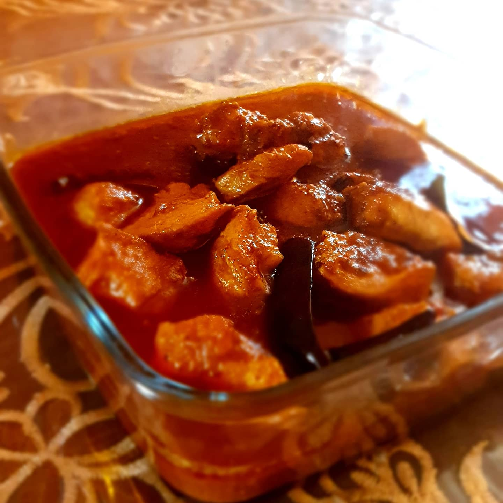
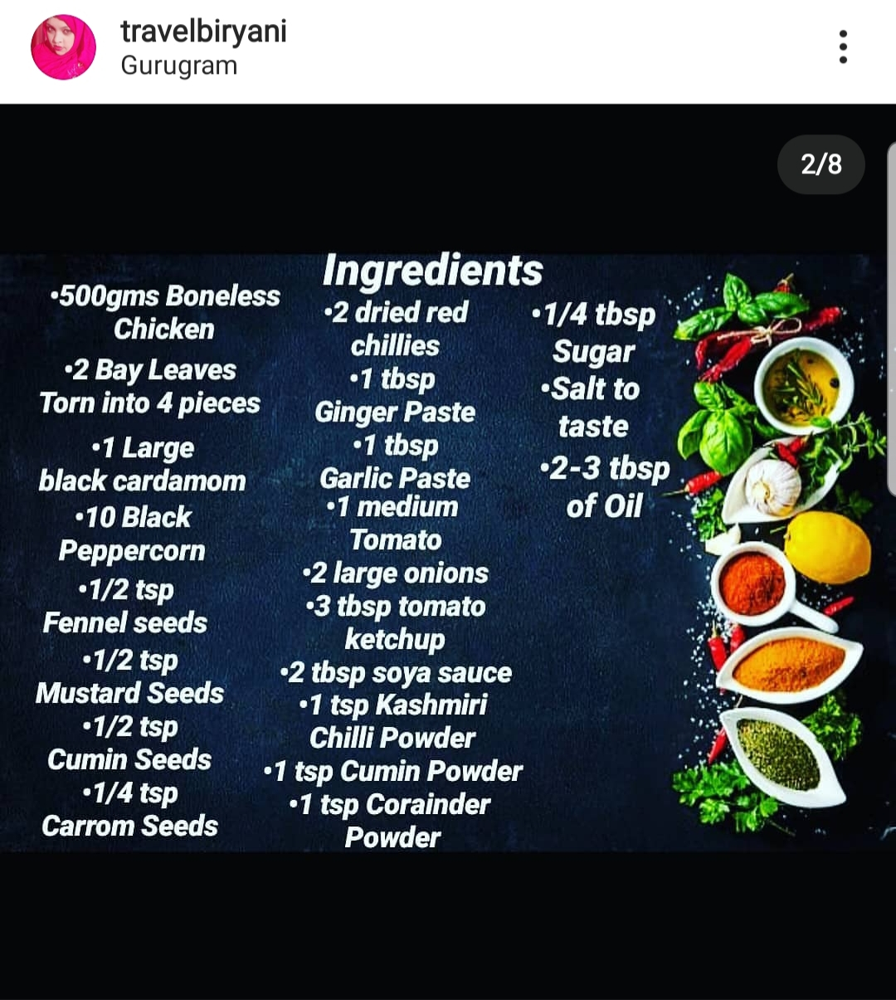
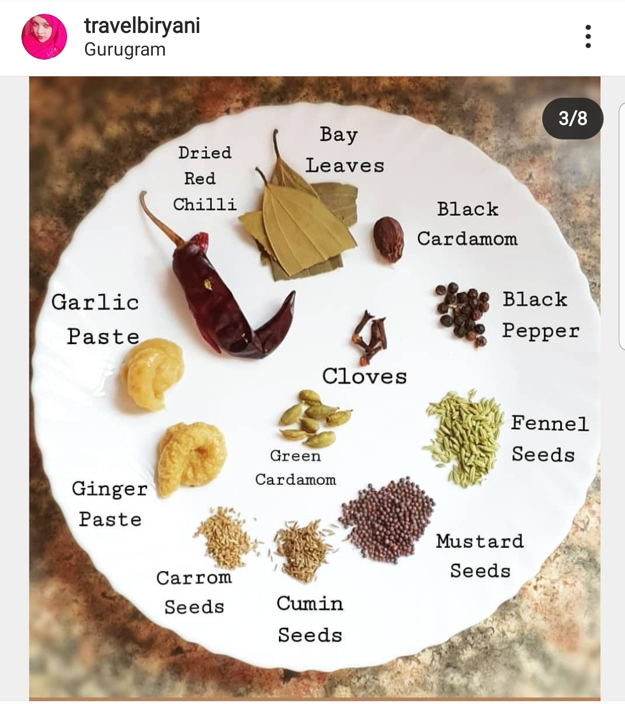
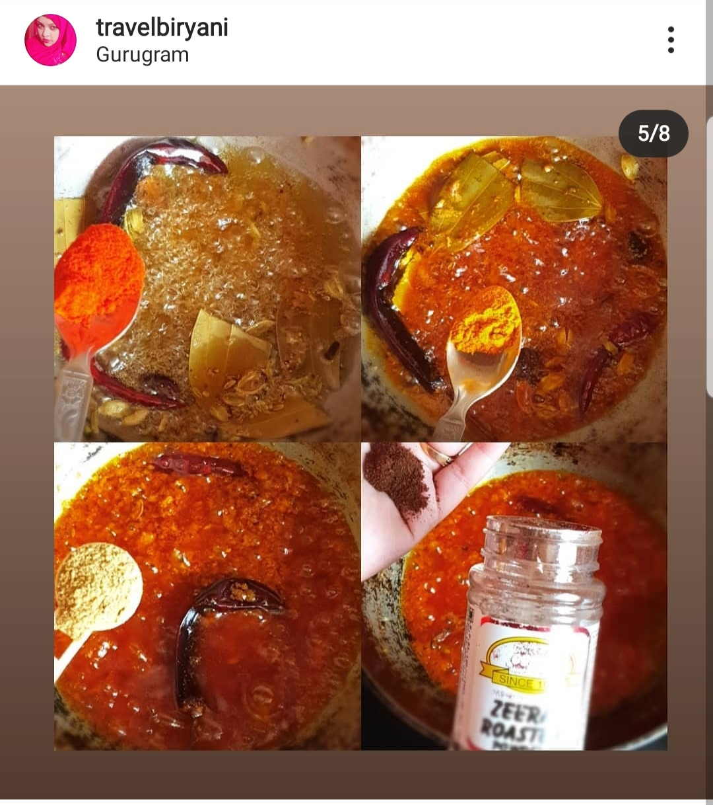
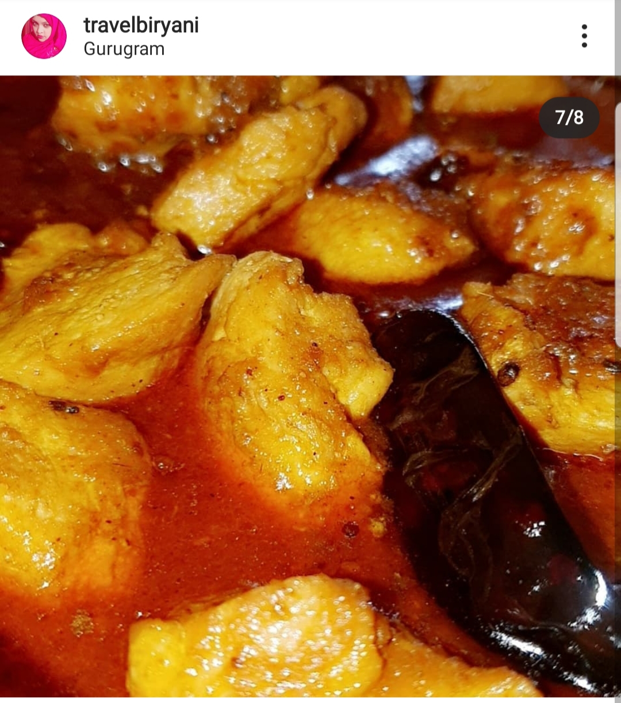

**Time**{: .firstword} is an uber precious commodity and with the hustle and bustle of modern day living its getting even more difficult for us to manage a quick dinner after work or entertain sudden dinner guests at home.  
Well, we all have faced this at some point in time that we had very little time to brew up a delicious potful of chicken curry. This chicken curry recipe is meant exactly for those times. 

 

{:title="Chicken Curry Final"}

 

This spicy recipe of chicken became a favourite for my sister who every now and then insisted that I make this for her and due to its very simplicity I would happily oblige.

 

This recipe takes very little time approximately 20 mins from prep to plate and has the potency to please both the palate and the body. The ingredients are the very basic required for any Indian curry and is definitely not that flamboyant as most chicken curries seem to be.

 

So lets get started

 

|    Total Cooking        | Time   |
|--------------|--------|
| PREP TIME    | 7 mins |
| COOKING TIME | 13mins |

 

**Ingredients**{: .heading1 }

 

|                       | Ingredient             | Quantity                    |
|-----------------------|------------------------|-----------------------------|
| &#10003; | Chicken boneless       | 500gms                      |
| &#10003; | Bay leaves             | 2 leaves torn into 4 pieces |
| &#10003; | Black cardamom         |  1 large                    |
| &#10003; | Black peppercorn       | 10                          |
| &#10003; | Fennel seeds           |  1/2 teaspoon               |
| &#10003; | Mustard seeds          | 1/2 teaspoon                |
| &#10003; | Cumin seeds whole      | 1/2 teaspoon                |
| &#10003; | Carrom seeds           |  1/4 teaspoon               |
| &#10003; |  Dried red chilies     |  2 large                    |
| &#10003; | Ginger paste           | 1 tablespoon                |
| &#10003; | Garlic paste           | 1 tablespoon                |
| &#10003; | Medium tomato          | 1 Ground to paste           |
| &#10003; | Large onions           | 2 Ground to paste           |
| &#10003; | Ketchup                |  3 tablespoon               |
| &#10003; | Soya sauce             |  2 teaspoon                 |
| &#10003; |  Kashmiri chili powder | 1tbsp                       |
| &#10003; | Coriander powder       | 1 tbsp                      |
| &#10003; | Cumin powder           | 2 tbsp                      |
| &#10003; | Turmeric powder        | 1 teaspoon                  |
| &#10003; | Sugar                  | 1/4 teaspoon                |
| &#10003; | Salt                   | To taste                    |
| &#10003; | Oil                    | 2 to 3 tablespoon           |

 

{:title="Chicken Curry Ingredients"}

 
 

{:title="Chicken Curry Ingredients"}

 

**Method**{: .heading1 }

 

**Step 1:**{: .heading2 }

In a large pan

Add 2 to 3 tablespoon of oil (Refined or mustard as to taste)

When the oil heats, 

Add the chicken pieces and fry until it until sealed and remove from oil

Next add the dried red chilies, bay leaves and ginger garlic paste and fry for two minutes

Roast the remaining dry ingredients for 1 mint and blend them roughly and add to the oil

Next add the blended onion and tomato paste and fry......

{:title="Chicken Curry Grind"}

 

**Step 2:**{: .heading2 }

Add the
- Kashmiri chilli powder
- Cumin powder
- Coriander powder
- Turmeric powder
- Salt to taste
- Sugar 1/4 teaspoon

and fry well

{:title="Chicken Curry Ingredients"}

**Step 3:**{: .heading2 }

Add 3 tbsp of ketchup and 2 tbsp of soy sauce

Add the chicken....

Mix well...

Add a cup of water

{:title="Chicken Curry Ingredients"}

**Step 4:**{: .heading2 }

Cook x 7mins

Serve hot with steamed rice or rotis

{:title="Chicken Curry"}

 

Sharing a warm and delightful curry on a plateful of fluffy steamed rice with the people you love the most, this is what life is all about.

We often seem to look over all the blessings that we have and get stuck with the hectic life we have been taught to be a slave to.

It is at times like this the we need to slow down give ourselves an  essential break and just live at the moment. Food and family are the two most essential 
Gift the Almighty has bestowed upon us and let us cherish them together.

 

Ahhhhhh...... The very appeal of this dish, go ahead and try it for yourself, I bet you would absolutely love it.....

Go ahead try it the very next chance you get....

And I shall now go figure out what next to make for you...

 

**Suggestions**{: .heading1 }
- The chicken pieces should be 1x1  inch to decrease the cooking time
- It is always advisable to use homemade spices to bring out flavors better
- Spices should be roasted to increase their flavors
- The heat of the dish may be more for some hence it is advisable to add the chilli powder to taste.
- This dish goes better with plain white rice.

 

I sure hope you guys liked the recipie.

 

I look forward to your comments and reviews. 

 

Thank you for your support, follow us on <a href="https://www.facebook.com/travelBiryani/" title="Travel Biryani Facebook" target="_blank" rel='external nofollow'> Facebook </a>, <a href="https://www.instagram.com/travelBiryani/" title="Travel Biryani Instagram" target="_blank" rel='external nofollow'> Instagram </a>
and <a href="https://twitter.com/travelBiryani" title="Travel Biryani Twitter" target="_blank" rel='external nofollow'> Twitter </a> and please do NOT forget to share our recipes.....

