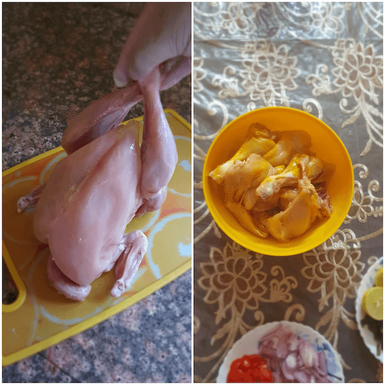

 

Everyone loves chicken and everyone loves potatoes so imagine the combination of both

 

Well, we do not need to imagine much because the combination of both in a rich airy fairy gravy has been a hit with the people of the entire Indian subcontinent since time immemorial. It is enjoyed in different ways in India, Pakistan, Bangladesh and pretty much in all of the Indian subcontinent. 

 

This recipe dating back to centuries is a must try as it gives the best combination of savoury and spicy flavours appealing to the palate. A more bland form of it is enjoyed in European countries in the form of Chicken with roasted potatoes.

 

My personal favourite, this dish was a Sunday favourite from my childhood, a legacy passed on to me by my dad, a dish he learnt well and perfected in his years as a student in Aligarh Muslim University. I would look forward to dad cooking every Sunday, I remember helping him peel the garlic and cut the tomatoes, my childhood was great and food , my greatest love is a gift I get from my family.

 

Chicken with potato curry Or Aloo Chicken as it is well known, is an easy to make, quick quick curry, that embeds all the flavours of garam masala and the potatoes absorb the essence of the chicken and the gravy, their spongy texture and inherent sweetness is what makes this dish a hit.

 

Let us not only keep it limited to a Sunday feast but it can be made on weekdays too. The best combination with plain white rice and a little bit of tomato and cucumber salad, yum yum. It also goes well with rotis, but not all that well.

 

So let us begin

 
 

{:title="Chicken with Potato Gravy"}

 
 

|    Division  | Time    |
|--------------|---------|
| Prep Time    | 15 mins |
| Cook Time    | 20 mins |

 

Serves 4 to 6

 
 

{:title="Chicken with Potato Gravy ingredients"}

 
 

|                       | Ingredient                | Quantity             |
|-----------------------|---------------------------|----------------------|
| &#10003; | Chicken on bone           | 1kg                  |
| &#10003; | Potatoes                  | 6 to 8 halved        |
| &#10003; | Onions                    | 2 medium             |
| &#10003; | Coriander leaves          | 1 cup                |
| &#10003; | Spring onions             | 1 cup                |
| &#10003; | Tomatoes                  | 2 chopped            |
| &#10003; | Garlic cloves             | 10                   |
| &#10003; | Lemon juice               | 1 lemon              |
| &#10003; | Chat masala               | 1 tbsp               |
| &#10003; | Ginger paste              | optional             |
| &#10003; | Cardamom powder           | 1 teaspoon           |
| &#10003; | Meat masala powder        | 1 teaspoon           |
| &#10003; | Khada Garam masala powder | 1tbsp or as to taste |
| &#10003; | Garlic Powder             | 1 tbsp               |
| &#10003; | Cinnamon powder           | 1 teaspoon           |
| &#10003; | Kashmiri chili powder     | 1 1/2tbsp            |
| &#10003; | Coriander powder          | 2 tbsp               |
| &#10003; | Cumin powder              | 1 1/2 tbsp           |
| &#10003; | Turmeric powder           | 1 teaspoon           |
| &#10003; | Sugar                     | 1/4 teaspoon         |
| &#10003; | Salt                      | To taste             |
| &#10003; | Oil                       | 2 to 3 tablespoon    |
| &#10003; | Mace powder               | 1/3 teaspoon         |
| &#10003; | Nutmeg powder             | 1/3 teaspoon         |

 

**Method**{: .heading1 }

**Step 1: Prepping the Chicken**{: .heading2 }

- Cut down the whole chicken into pieces, wash well
- Use 1/2 teaspoon of the turmeric powder(save rest for later) with salt and marinate the chicken.
- Set aside till you ready the remaining ingredients.

 
 

{:title="Preparing The Chicken"}

 
 

**Step 2: Prepping the Chicken Curry ingredients**{: .heading2 }

- Take 6 to 8 potatoes, peel and half each.
- Next chop the tomatoes, garlic, onions ,spring onions and coriander roughly, you do not need to be a chef here, no ones judging you on your chopping skills!!!! Lol!!
- Get the masalas in order, lets go clockwise from the inner to the outer circle,
- Inner circle starting with turmeric, cumin , khada masala powder
Outer circle starting with red chilli, meat masala, cardamom powder, cinnamon powder, mace powder, nutmeg powder ,garlic powder and  coriander powder.

 
 

{:title="Prepping the Chicken Curry ingredients"}

 
 

**Step 3: Shallow frying the chicken and potatoes**{: .heading2 }

- In a pan take 2 to 3 tablespoon of oil (for this recipe mustard oil is most preferred)
- The chicken is happily rested, now time to fry, until it catches a slight golden colour, fry in high flame initially and then lower the flame.
Repeat the same with potatoes and set aside.

 
 

{:title="Shallow frying the chicken and potatoes"}

 
 

**Step 4: Preparing the gravy for Chicken Curry**{: .heading2 }

- Now in the same oil, start by adding the ginger and garlic paste.
- Then add the tomatoes and onions, sauté well.
- Next when they turn a little mushy, add the spices and fry for 2 mins.
- Next add the spring onions.

 
 

{:title="Preparing the gravy for Chicken Curry"}

 
 

**Step 5: Adding the chicken and potatoes to the gravy**{: .heading2 }

- Once the sauce reduces down, add the chicken and potatoes.
- Add a cup of water, cover and cook on a simmer for 10 minutes.

 
 

{:title="Adding the chicken and potatoes to the gravy"}

 
 

Once the chicken is cooked,garnish with the coriander leaves, add on the juice of one lemon.  
And here we go, our Aloo Chicken is ready,a Bengali Delicacy, which is often cooked on special occasions as well as anytime one has to host guests. 

 

The spicy incorporation of masalas with the tender chicken gives a burst of flavours and tends to the taste buds.  

 

The potatoes aid in thickening the flavourful gravy and adding a delicious bite to the entire curry.  

 

The potato helps in binding the flavours together and the spices seep into the chicken making it a melt-in-the-mouth wonder.  

 
 

{:title="Chicken and Potatoes Gravy Final"}

**End notes**{: .heading2 }   
1) If you use boneless chicken , cooking time reduces substantially.  
2) Cutting the potatoes smaller also has the same affect on cooking time.  
3) It is advisable to add turmeric to the chicken but you can skip the marination all together.  
4) You can alter the masalas as per you taste, but do not skip the cinnamon and cardamom  
5) It is advisable to use mustard oil for this recipe as it enhances the flavours , however you can also use any other vegetable oil, please refrain from using olive oil or ghee as it totally alters the taste of the dish.  
6) Served best with plain white rice and a green chilli.  
7) Mutton, duck and beef can also be used.  
8) Do not overcook as the potatoes tend to soften and melt thus altering the taste of the curry.    

 
 

Thank you for your support, follow us on <a href="https://www.facebook.com/travelBiryani/" title="Travel Biryani Facebook" target="_blank" rel='external nofollow'> Facebook </a>, <a href="https://www.instagram.com/travelBiryani/" title="Travel Biryani Instagram" target="_blank" rel='external nofollow'> Instagram </a>
and <a href="https://twitter.com/travelBiryani" title="Travel Biryani Twitter" target="_blank" rel='external nofollow'> Twitter </a> and please do NOT forget to share our recipes.