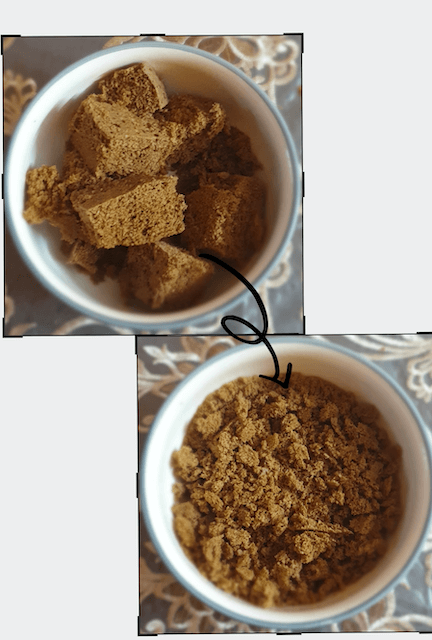

**Every**{: .firstword} once in a while we totally need an easy cheat, a mouthful of happiness in this super duper easy to make chocolate ball.

 

Just a few ingredients is all we need to start up a killer dessert.

 

It is a favourite with kids and an easy desert when we run out of time to bake something or time to order .
It is also a great way to use up left over tea cakes.

 

It is a perfect combination of a chocolate cake and a chocolate ball, using only the most minimal of ingredients like cocoa powder and desiccated coconut.

 

So lets get started.....

 

 

|    Total Cooking        | Time   |
|--------------|--------|
| Total TIME    | 10 mins |

 

Makes 10 to 12 serves

 

**Ingredients**{: .heading1 }

 

| ab                    | Ingredient                                                              | Quantity           |
|-----------------------|-------------------------------------------------------------------------|--------------------|
| &#10003; |  Left over tea cake/ dry cake   ( any flavour but turns out best with chocolate or vanilla based cakes)                                          | 500gms             |
| &#10003; | Chocolate syrup                                                         | 1 Cup              |
| &#10003; | Hot chocolate powder sweetened                                          | 1/2 Cup            |
| &#10003; | Desiccated coconut                                                      | 1/2 cup (optional) |
| &#10003; | Chopped mixed nuts                                                      | 1/4 cup (optional) |
| &#10003; | Instant coffee                                                          | 1 tablespoon       |
| &#10003; | Castor sugar                                                            | To Taste           |

 

**Method**{: .heading1 }

 

**Step 1:**{: .heading2 }

{:title="Tea Cakes"}

 

**Step 2:**{: .heading2 }

- Add the chocolate powder
- Desiccated coconut
- 1 tablespoon instant coffee
- Sugar powder to taste 
- And mix well

{:title="Chocolate balls Ingredients"}

**Step 3:**{: .heading2 }

- Add the chocolate syrup 
- Mix all the ingredients together

**Step 4:**{: .heading2 }

Make into balls

{:title="Chocolate balls"}

 

Garnish with coconut powder and chocolate syrup

 

{:title="Chocolate balls Garnish"}

 

You may simply call it a chocolate ball recipe or a chocolate cake ball, just drizzle in a little bit of desiccated  coconut and it becomes a tasty chocolate coconut ball, give up on the coconut and put in a higher note of coffee powder and wallah it becomes a chocolate coffee cake ball.

 

So there you have a recipe that you can play with to your hearts content.

 

Nothing goes to waste here, its ideal to use up all the remaining cakes, you can try it with flavoured or milk bread too if you wish and as a matter of fact you can blitz soft cookies in the mixer too and go ahead and make biscuit chocolate balls if you like.

 

Be rest assured that its gonna be a hit with children, so much so you can turn it into a fun activity to do with the kids and the best part about it is you gut to see the joy on their faces when they get to lick the bowl at the end of it all.

 

So I really wish  you guys try out this recipe, let me know your thoughts and variations

 

And please do subscribe to travel biryani and like us on Facebook , Twitter and Instagram.

 

Thank you for your support, follow us on <a href="https://www.facebook.com/travelBiryani/" title="Travel Biryani Facebook" target="_blank" rel='external nofollow'> Facebook </a>, <a href="https://www.instagram.com/travelBiryani/" title="Travel Biryani Instagram" target="_blank" rel='external nofollow'> Instagram </a>
and <a href="https://twitter.com/travelBiryani" title="Travel Biryani Twitter" target="_blank" rel='external nofollow'> Twitter </a> and please do NOT forget to share our recipes.....
