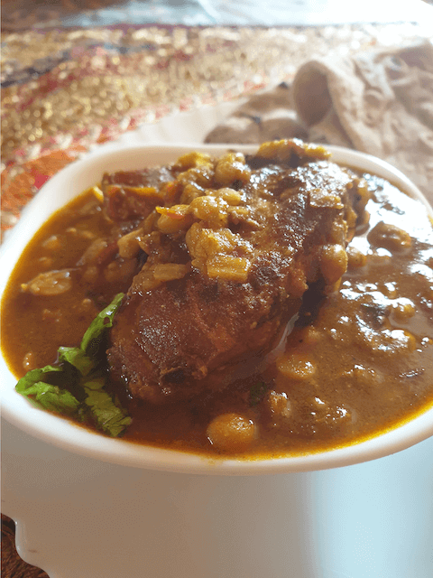

People all over the world have been known to be confused over questions like  
What to do with those last pieces of chicken left over after the big feast is done?  
Or how to use up the chicken carcass after all the nice boneless meat has been taken off?  
Or how to feed a large crowd when you have just one chicken?  
Or what to do when you have left over curry from dinner last night?  

 

Well this recipe is sure to help us out solve that dilemma

 

Well people from the entire south east asia and especially the Indian subcontinent have always known to be "jugadus"

 

People here rarely let food go the waste ! People here know the importance of a single grain of food all thanks to the majority of people living in poverty. This has made people come up with ingenious ways of using up every part of the animal that they consume, they let nothing go to waste and make sure to get the maximum out of a chicken for sure.

 

A combination of chicken and pulses is eaten in a lot of different ways, a combination of  meat and chickpeas is famous in the Middle East especially Turkey.

 

The very adaptation of the combination of chicken with pulses In the Indian subcontinent is known famously as Dhal Gosht or Dhal chicken or Dalcha. It is usually made in weddings where a large crowd is to be fed and is mostly a combination of channa dhal (split chickpeas) with chicken or mutton. It is very very economical and extremely delicious.

 

Also the extra pieces of chicken like the wings or the neck and livers are used in making this dish.

 

Well my adaptation to this is rather cheeky, I have come up with the best way of converting the left over chicken curry from the previous meal into a completely new meal via means  of this curry.  
I find it brilliant!! Let me know if you do too.

 

It is rather very very easy and is ready very fast and with the least amount of cutting and chopping to do.

 

So lets get started

 
 

| Division     | Time    |
|--------------|---------|
| PREP TIME    | 10 mins |
| COOKING TIME | 10 mins |

 

Serves 4-8

 

{:title="Dal Chicken"}

 

**Ingredients**{: .heading1 }

|                       | Ingredient                    | Quantity                        |
|-----------------------|-------------------------------|---------------------------------|
| &#10003; | Chicken curry or waste pieces | Any quantity that is left over  |
| &#10003; | Onion                         | 1 medium/ chopped               |
| &#10003; | Tomatoes                      | 1 medium/ chopped               |
| &#10003; | Spring onions                 | 1 cup chopped                   |
| &#10003; | Coriander leaves              | 1 cup chopped                   |
| &#10003; | Whole red chilli              | 2 - 4                           |
| &#10003; | Cardamom pods                 | 4 - 5                           |
| &#10003; | Black cardamom                | 1 large                         |
| &#10003; | Cumin seeds                   | 1/2 teaspoon                    |
| &#10003; | Cloves                        | 2-4                             |
| &#10003; | Kashmiri Red Chilli powder    | 1 teaspoon                      |
| &#10003; | Turmeric powder               | 1/2 teaspoon                    |
| &#10003; | Coriander powder              | 1 1/2 teaspoon                  |
| &#10003; | Cumin powder                  | 1/2 teaspoon                    |
| &#10003; | Channa dal                    | 1 cup approx. 250gms            |
| &#10003; | Water                         | 200ml                           |
| &#10003; | Salt                          | To taste                        |
| &#10003; | Oil                           | 1 tablespoon                    |
| &#10003; | Tomato ketchup                | 1 tablespoon                    |

 

{:title="Dal Chicken Ingredients"}

 
 

**Method**{: .heading1 }

**Step 1 Getting the ingredients of Dal Chicken in order:**{: .heading2 }

 
I have always seen that before cooking, getting the items in order plays a vital role in the outcome of the dish.  
Firstly, you do not miss out on ingredients.  
Secondly, I am clumsy so whenever I try to fiddle around trying to get the ingredients in the course of making the dish. I always burn something!! Relatable?  

 

Anyways steps
- Wash and soak the dal, overnight preferably, but around 2-4 hrs of soaking is also acceptable.
- Chop the tomatoes, spring onions , onions and coriander leaves and assort the spices.
Get the curry out of the fridge if you are using left over curry, or else cut and wash the pieces of raw chicken you wish to cook with.

 
 

{:title="Dal Chicken Ingredients"}

 
 

**Step 2 Starting the Dal Chicken curry:**{: .heading2 }

- Take a pressure cooker and heat oil around 1 tablespoon. Any oil will do.(tastes best with ghee  )
- Add cumin seeds, cardamom pods, black cardamom(bruise before adding), coriander seeds, cloves and red chilli , let the ingredients sauté.

 
 

{:title="Dal Chicken Curry Start"}

 
 

**Step 3 Frying the main ingredients of Dal Chicken:**{: .heading2 }

- Add the onions and tomatoes. Let it soften for around 2 minutes
- Next add all the spices, red chilli powder ,turmeric powder, coriander powder, cumin powder and salt, sauté for a minute.

 
 

{:title="Dal Chicken Frying"}

 
 

**Step 4 Adding the Channa dal:**{: .heading2 }

 

Once it softens a bit and the spices are incorporated into the tomatoes and onions add the channa dal. Mix well

 
 

{:title="Adding the Channa dal"}

 
 

**Step 5 Adding the Chicken:**{: .heading2 }

- Add the tomato ketchup (any tomato ketchup will do); you can skip too if you wish.
- Add the chicken curry or the chicken pieces : if you add the curry you do not need to fry for 2 minutes, if you add raw chicken please do fry for 2 minutes.

 
 

{:title="Adding the Chicken"}

 
 

**Step 6 Closing off the cooker after adding the final ingredients:**{: .heading2 }

- Add 200 ml of water.
- Add the spring onions and coriander leaves.
- Mix well and close the lid of the pressure cooker , for 5 whistles 

 
 

{:title="Adding the final ingredients"}

 
 

{:title="Before closing Cooker"}

 
 

**Step 7 Cook for Five Whistles:**{: .heading2 }

 

Once done serve with roti or rice, it goes great with both  
People in North India as in Uttar Pradesh, Punjab etc prefer it with Tawa roti

 
 

{:title="Dal Chicken With Roti"}

 

Usually it is eaten with rice in the North Eastern part of India and Bengal.

 
 

{:title="Dal Chicken With Rice"}

 
 

So well I hope the next time you have some left over curry you guys will surely try this.  
And be sure to let me know.  
Lots of love.  

 

Thank you for your support, follow us on <a href="https://www.facebook.com/travelBiryani/" title="Travel Biryani Facebook" target="_blank" rel='external nofollow'> Facebook </a>, <a href="https://www.instagram.com/travelBiryani/" title="Travel Biryani Instagram" target="_blank" rel='external nofollow'> Instagram </a>
and <a href="https://twitter.com/travelBiryani" title="Travel Biryani Twitter" target="_blank" rel='external nofollow'> Twitter </a> and please do NOT forget to share our recipes.