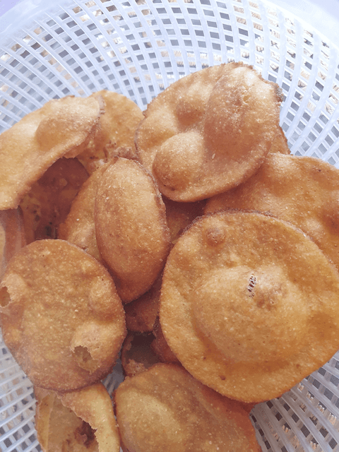
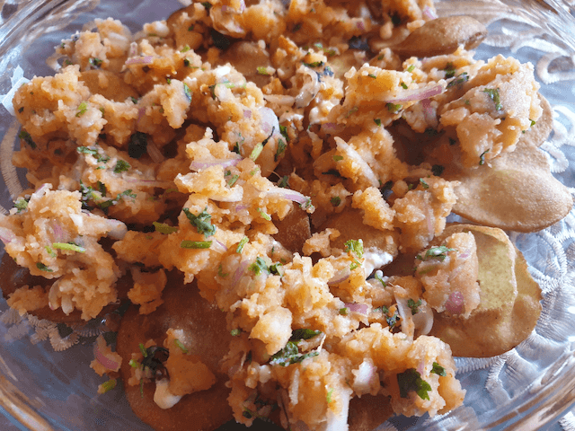
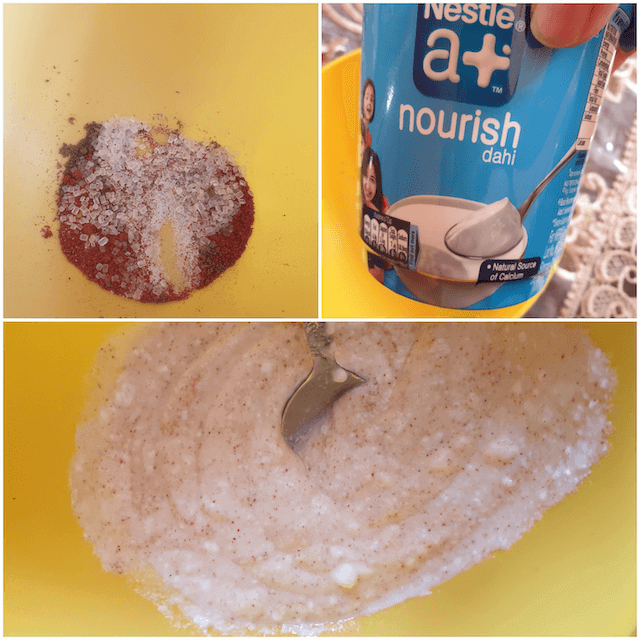
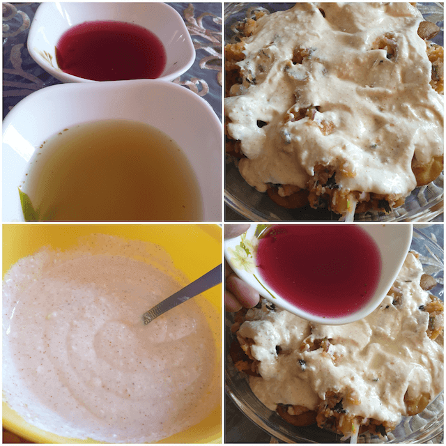
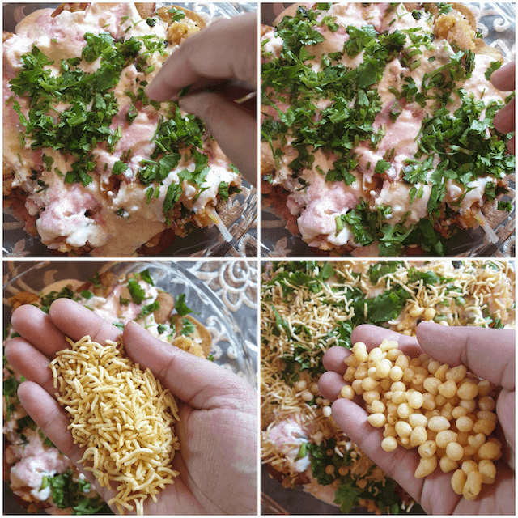
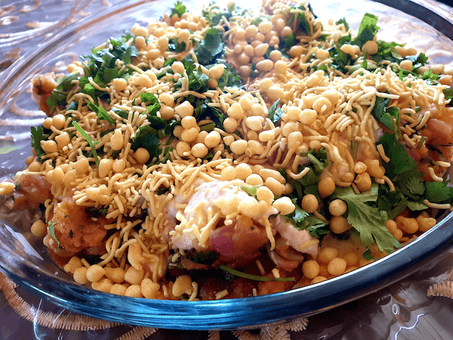

**Exceptionally**{: .firstword} easy chaat dish, to tingle the senses. Chaat as we know has several origins and is immensely popular in the entire indian subcontinent, papri chaat is one among the most popular chaat dishes. It is found almost in all the famous street food joints around the world serving Indian chaat, a tamarind and mint sauce is what sets it apart, it is a very very healthy vegetarian option for the diet conscious folks. Packed with proteins and minerals and the goodness of lactobacilli.

 

Can be made spicy or medium spicy as per palate.

 

The cooling effect of curd is what makes it all the more popular in the summer months, easily put together with minimal ingredients and comes together super fast.

 

Eaten all around the Indian subcontinent including India, Pakistan, Bangladesh, each place has its own recipe and here is one of the easiest recipes I have come across.  

 

Hope you guys enjoy it.

 
 

{:title="Papri Chaat"}

 
 

| Division       | Time       |
|----------------|------------|
| PREP TIME      | 14 minutes |
| COOKING TIME   | 6 minutes  |
| ASSORTING TIME | 10 minutes |

 
 

|                       | Ingredients             | Quantity                                                                                                                                                      |
|-----------------------|------------------------|---------------------------------------------------------------------------------------------------------------------------------------------------------------|
| &#10003; | Curd                   | 2 cups beaten well                                                                                                                                            |
| &#10003; | Sugar                  | 2 teaspoons                                                                                                                                                   |
| &#10003; | Onions                 | 1/2 finely chopped                                                                                                                                            |
| &#10003; | Coriander leaves       | 1/2 cup                                                                                                                                                       |
| &#10003; | Mint leaves            |  1/2 cup(optional)                                                                                                                                            |
| &#10003; | Salt                   | To taste                                                                                                                                                      |
| &#10003; |  Chaat masala           | 1/2 teaspoon                                                                                                                                                  |
| &#10003; |  Mung bean sprouts     | (optional)                                                                                                                                                      |
| &#10003; |  Sweet tamarind sauce  | 1 tablespoon                                                                                                                                                  |
|                       |                        | (store bought or homemade)                                                                                                                                    |
|                       |                        | (combine tamarind pulp ,sugar, a bit of red chilli powder                                                                                                     |
|                       |                        |  and a spoon of oil and bring to a boil with 1/2 cup water)                                                                                                   |
| &#10003; | Boiled Potatoes        | 2 medium sized, (peel cut into 1x1cm cubes and pop in the microwave for 6 mins)                                                                               |
| &#10003; | Sev                    | 1 cup                                                                                                                                                         |
| &#10003; | Lemon juice            | 1 lemon                                                                                                                                                       |
| &#10003; | White pepper powder    | 1tbsp or as to taste                                                                                                                                          |
| &#10003; | Boondi                 |  1 cup (optional)                                                                                                                                             |
| &#10003; | Peanuts                |  1/4th cup                                                                                                                                                    |
| &#10003; |  Kashmiri chili powder | 1 & 1/2tbsp                                                                                                                                                     |
| &#10003; | Mint sauce             | 1/2 cup (preparing my grandmum's easy mint chutney will be a separate recipe soon, usually a container of it is stowed in the fridge that lasts up to 15 days) |
| &#10003; | Green chillies         | 2 finely chopped (optional)                                                                                                                                     |

 
 

**Method**{: .heading1 }

**Step 1:**{: .heading2 }

 

Lay the papris at the base of a flat wide bowl or container.

{:title="Papri Base"}

 
 

**Step 2:**{: .heading2 }

Cut the boiled potatoes into small 1cm pieces and lay over the papris.

 
 

{:title="Laying Papri"}

 
 

{:title="Potato over Papri"}

**Step 3:**{: .heading2 }

Next beat the curd well with the salt, sugar, chilli powder, chaat masala and spread it well over the papris and potatoes.

 
 

{:title="Beaten Curd"}

 
 

**Step 4:**{: .heading2 }

Layering the chaat. 

 
 

{:title="Chaat Layering"}

 
 

**Step 5:**{: .heading2 }

Next, add the finely chopped onions and some coriander leaves (leave some coriander leaves for garnish).

 

Next, add the two sauces- the mint sauce and the tamarind sauce over it.

 
 

{:title="Adding Sev"}

 
 

**Step 6:**{: .heading2 }

Add the boondi , peanuts and sev lavishly.

 

Garnish with the remaining coriander leaves.

 
 

{:title="Papri Chaat"}

 
 

Chill for 15 mins and serve.  
This is an optional step.

 

You can add pomgranate seeds if you like.  
I didn't have them.

 

For a healthier option, we can use sprouts and paneer instead of potatoes.  
Sweet potatoes can also be used as an alternative.

 
 

Thank you for your support, follow us on <a href="https://www.facebook.com/travelBiryani/" title="Travel Biryani Facebook" target="_blank" rel='external nofollow'> Facebook </a>, <a href="https://www.instagram.com/travelBiryani/" title="Travel Biryani Instagram" target="_blank" rel='external nofollow'> Instagram </a>
and <a href="https://twitter.com/travelBiryani" title="Travel Biryani Twitter" target="_blank" rel='external nofollow'> Twitter </a> and please do NOT forget to share our recipes.

