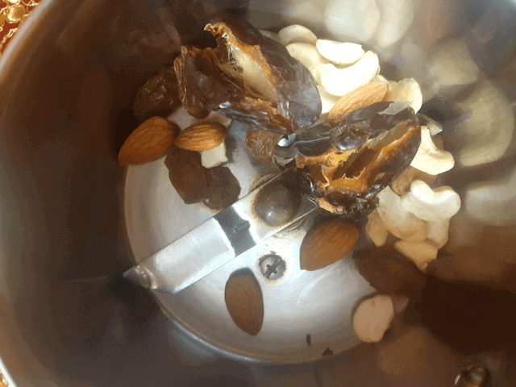
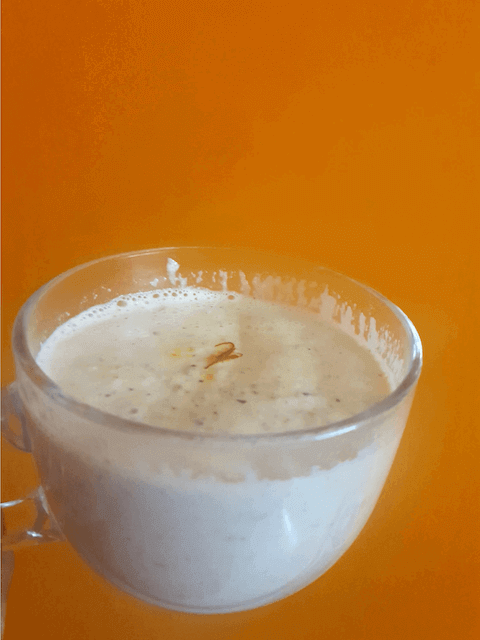

Most of the times, its so difficult to inculcate good taste in healthy food, but this is something that I have made through my endless experiments to make something wholesome yet tasty for my family

 

The same old milk gets boring and is often not that tasty, how to make milk better??

 

Well with the goodness of added nuts and dry fruits.  
The Indian style badam milk is an easy to make almond milk, which is an amazing way of using nuts in a drink and it can be made easily at home.

 

The store brought badam milk concentrates and powders are high on sugar and fail to provide the required nutrition, this badam milk is something that not only has no sugar at all but is totally totally healthy.  
Yes beverages can be nutritious and healthy, nuts also help in enhancing immunity.

 

My husband and daughter both love it, you know how difficult it is to get kids to drink milk, but believe me not with this recipe, they drink it up without any fuss.

 

Dry fruits and nuts are a great source of nutrition and should be really inculcated in the diet.

 

This drink goes great with parathas at breakfast or can be given at bedtime too. It is a total must in cold weather.

 

I Strongly recommend it for kids, for its nutritional values and my husband being an IT professional where all he does is use a lot of his brains all through the day, he definitely benefits from the added nutrition.

 

I totally give it always to my family and it would be great if you do too.

 

So lets get started

 
 

| Division     | Time   |
|--------------|--------|
| PREP TIME    | 5 mins |
| COOKING TIME | 10mins |

 

Serves 3 cups  (2 to 4)

 

{:title="Badam Milk Cover"}

 
 

**Ingredients**{: .heading1 }

 

|                       | Ingredient | Quantity               |
|-----------------------|------------|------------------------|
| &#10003; | Almond     | 5 to 6                 |
| &#10003; | Cashews    | 7 to 10                |
| &#10003; | Milk       | 500 ml or half a liter |
| &#10003; | Dates      | 4 to 5                 |
| &#10003; | Raisins    | 7 to 9                 |
| &#10003; | Munaka     | 5 to 7                 |
| &#10003; | Saffron    | A few strands          |
| &#10003; | Warm water | 10ml                   |

 
 

{:title="Badam Milk Ingredients"}

 
 

Take a few strands of saffron and add around 10ml of luke warm water

 
 

{:title="Saffron"}

 
 

**Method**{: .heading1 }

**Step 1: Blending the dry fruits**{: .heading2 }

In a dry ingredient blender, put in the cashews,almonds,dates, raisins or munakka and blitz into a fine powder.

 

Separate dry fruits

 
 

{:title="Dry Fruits"}

 
 

Put into a blender

 
 

{:title="Dry Fruits"}

 
 

Blend into a coarse powder.

 
 

{:title="Dry Fruits"}

 
 

**Step 2: Making the milk base**{: .heading2 }

- In a deep bottomed pan, heat around 500 ml of milk
- Once it comes to a boil add the soaked saffron and boil for 2 mins.
- Once the colour changes to a sweet light golden
- Add the ground nuts powder and boil for further 3 mins.
- Boil around 500ml milk in a heavy bottomed pan

 
 

{:title="Milk"}

 
 

Adding the saffron to the milk

 
 

{:title="Adding Saffron to Milk"}

 
 

Adding the ground nuts to the milk

 
 

{:title="Adding Ground Nuts to Milk"}

 
 

Boil the milk for 3 to 5 more minutes.

 
 

{:title="Boiling Milk With Nuts"}

  
  

Garnish with a few strands of saffron and well our healthy nutritious badam milk is ready.

 
 

{:title="Badam Milk"}

 
 

Here are few commonly asked questions about this recipe and I have tried my best to answer them for you

 

**Question 1: Can this powder be stored?**{: .heading2}  
Yes, it can be for up to 1 week in air tight containers, I usually make a batch of around 200 gms of almonds, 100 grams cashews, 50 gms each of dates and raisins and seal it in an air tight container or zip pouch and store it for a week, beyond that it turns soggy and looses a lot of its taste.

 
 

**Question 2: Is it healthy for children?**{: .heading2}  
 It is actually extremely healthy for children and it being so very nutritious and tasty, children drink up too and it provides a large part of the essential dietary nutrients.

 
 

**Question 3: Can a diabetic take this?**{: .heading2}  
Yes, it is okay for a diabetic to take it, dates provide the sweetness, but are not all that bad for diabetes, however if you have very high blood sugar levels, you can very well avoid the dates and raisins.

 
 

**Question 4: Can a pregnant woman drink the badam milk?**{: .heading2}  
Yes, nutritional needs increase two to three folds during pregnancy and hence this drink is brilliant for pregnancy.

 
 

**Question 5: Is it good when on a diet?**{: .heading2}  
Taking it when on a diet actually helps because it provides a lot of energy and is filling .

 
 

**Question 6: Is it good for body building?**{: .heading2}  
Its a renowned fact that all the Akharas or Indian style gyms would always top up their pehalwans on Badam milk and lassi, why? Because again, the amount of nutrition it provides and the proteins essential for body building.

 
 

**Question 7: Can it be taken everyday?**{: .heading2}  
For children , yes it is recommended everyday, however for adults, twice or thrice a week is sufficient, cus nuts have a lot of cholesterol.

 
 

**Question 8: Is it safe for nut allergic individuals?**{: .heading2}  
People allergic to nuts better avoid it, however the same thing can be made with only dates and raisins, and that is also extremely tasty and healthy

 
 

**Question 9: What are the nuts that can be used in this?**{: .heading2}  
You can experiment with nuts, but of course they taste best with cashews and almonds, hazelnuts are also great, however I do not think groundnuts or peanuts would work so do not try that.

 
 

**Question 10: What are the milk substitutes that can be used, as a vegan?**{: .heading2}  
If you are a vegan you can try making the same with almond or soy milk.

 
 

Thank you for your support, follow us on <a href="https://www.facebook.com/travelBiryani/" title="Travel Biryani Facebook" target="_blank" rel='external nofollow'> Facebook </a>, <a href="https://www.instagram.com/travelBiryani/" title="Travel Biryani Instagram" target="_blank" rel='external nofollow'> Instagram </a>
and <a href="https://twitter.com/travelBiryani" title="Travel Biryani Twitter" target="_blank" rel='external nofollow'> Twitter </a> and please do NOT forget to share our recipes.