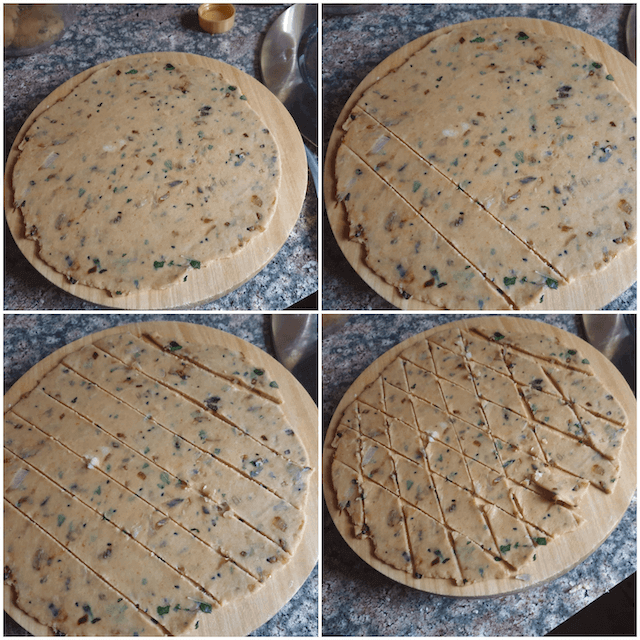

Come the evening teatime, we always crave something that just satiates the hunger pangs till dinner, well this is an ideal recipe for those times, a perfect teatime snack, can be taken for journeys it a perfect anytime and everytime snack. If made in larger quantities , can be store for more than a month or two. 

 

Namkeen is made and eaten all over India, but this is a recipe I picked up during my college days, in South India, I would not fly back home during Eid holidays and would go exploring Kerela with my Friends, I would stay at their houses and savour the delicious food their Mum'Z would make for me. Those days were absolutely amazing.

 

This recipe is a South Indian version of the famous namkeen and it tastes beyond words.

 

I have made this in large quantites and gifted my friends in Diwali and Christmas too. Nani makes large quantities of this during Ramadan and we snack on it after Ifter. Its a festive Indian snack after all.

 

Its ideal for packing up as light snack for kids on road trips, this onion namkeen and tea are friends for life. 
This is a crispy Indian snack and can be made at home very easily.

 

So lets see how to make this yummylicious , fast and easy snack.

 
 

| Division     | Time    |
|--------------|---------|
| PREP TIME    | 20 mins |
| COOKING TIME | 10 mins |

 

Serves 4 - 8

 

{:title="Onion Namkeen"}

 

**Ingredients**{: .heading1 }

 

|                       | Ingredient               | Quantity                 |
|-----------------------|--------------------------|--------------------------|
| &#10003; | Flour (All purpose)      | 500gms                   |
| &#10003; | Onion                    | 2 medium/ chopped finely |
| &#10003; | Curry leaves             | 3-4 sprigs               |
| &#10003; | Salt                     | To taste                 |
| &#10003; | Sugar                    | 2 Tablespoons            |
| &#10003; | Kalonji (nigella seeds)  | 1 teaspoon               |
| &#10003; | Oil                      | To deep fry              |
| &#10003; | Red chilli powder        | 1 teaspoon               |
| &#10003; | Baking Powder            | 1 teaspoon               |

 

**Method**{: .heading1 }

**Step 1: Preparing the ingredients for Onion Namkeen**{: .heading2 }

- Chop 2 medium sized onions finely
- Add 1 teaspoon of baking powder to 500gms of flour

 
 

{:title="Onion Namkeen Ingredients"}

 
 

**Step 2: Getting the onion mixture ready for Onion Namkeen**{: .heading2 }

- In a pan, add 2 teaspoons of oil
- When the oil heats, to the oil add the kalonji, followed by the curry leaves, salt sugar and red chilli poweder
- Saute for 3 mins or till the onions soften up and turn brown.

 
 

{:title="Frying onion base for Dough"}

 
 

**Step 3: Making the dough for Onion Namkeen**{: .heading2 }

- Add 1 teaspoon of baking powder to the flour
- Add 1/2 teaspoon of salt
- Finally add the onion mixture 
- Make a crumbly dough
- Following that add enough water little by little to form a soft to firm dough.
- Rest for 5 mins (optional)

 
 

{:title="Mixing onion mixture to Flour"}

 
 

Preparing the dough.

 
 

{:title="Final Dough"}

 
 

**Step 4:**{: .heading2 }

- Make 5 to 6 equal portions of the dough.
- Roll out each into circles of 8 to 10 cms each.

 
 

{:title="Rolling the dough For Onion Namkeen"}

 
 

**Step 5: Cutting the namkeen**{: .heading2 }

- Cut the dough into diamond shaped namkeens
- Repeat with all the doughs
- Set aside, dusting with flour, to avoid sticking

 
 

{:title="Cutting the dough For Onion Namkeen"}

 
 

**Step 6: Frying the Onion Namkeen**{: .heading2 }

- Lay aside a plate laden with paper towels
- Heat oil for deep frying in a deep pan
- Once the oil heats, start frying the namkeen.

 
 

{:title="Frying the Onion Namkeen"}

 
 

- Fry the namkeen until golden brown.
- Set aside on paper towels to dry the excess oil.

 
 

{:title="Double Frying the Onion Namkeen"}

 
 

- Cool for 15 mins
- Double fry for maximum crispiness

 
 

{:title="Onion Namkeen"}

 
 

Here are few commonly asked questions about this recipe and I have tried my best to answer them for you

 

**Question 1: How to make the namkeen crispy?**{: .heading2}  
Firstly adding oil to the dough, increases crispiness. Secondly double frying the namkeen also helps

 
 

**Question 2: Can this be given to children?**{: .heading2}  
Of course, children love it and its definitely a healthier option than store bought snack.

 
 

**Question 3: Other than all purpose flour what else can be added?**{: .heading2}  
Rice flour can be used, gram flour can be used, semolina can be used, but they all taste different, and the ones made with Atta do not turn out very crispy.

 
 

**Question 4: Is this healthy?**{: .heading2}  
It is relatively healthy, however it can be baked too, instead of deep frying, at a temperature of 200 for 10-15 minutes.

 
 

**Question 5: How long can this be stored?**{: .heading2}  
It can be stored in air tight containers for 30 to 45 days.

 
 

So there we are, an absolute delight is ready.  
You guys will love it, I am sure about that.

 
 

{:title="Diamond Onion Namkeen"}

 
 

Thank you for your support, follow us on <a href="https://www.facebook.com/travelBiryani/" title="Travel Biryani Facebook" target="_blank" rel='external nofollow'> Facebook </a>, <a href="https://www.instagram.com/travelBiryani/" title="Travel Biryani Instagram" target="_blank" rel='external nofollow'> Instagram </a>
and <a href="https://twitter.com/travelBiryani" title="Travel Biryani Twitter" target="_blank" rel='external nofollow'> Twitter </a> and please do NOT forget to share our recipes.