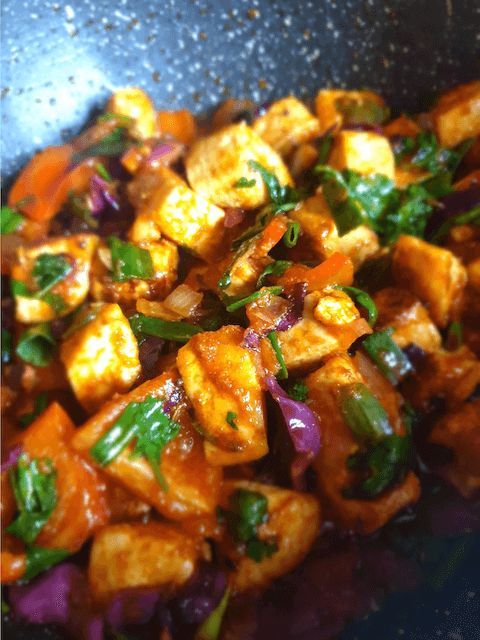
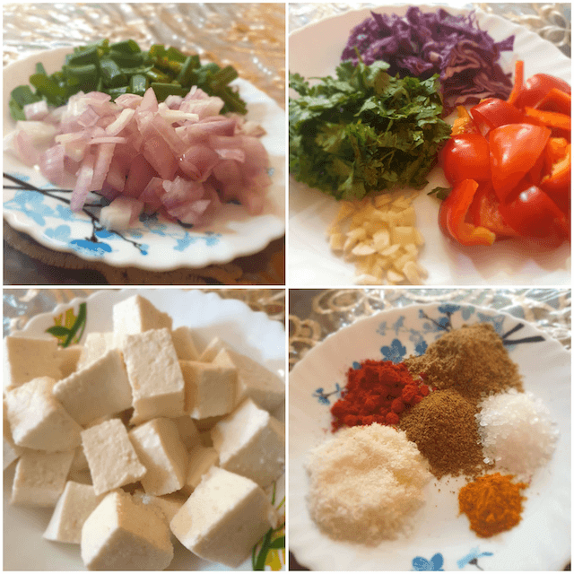
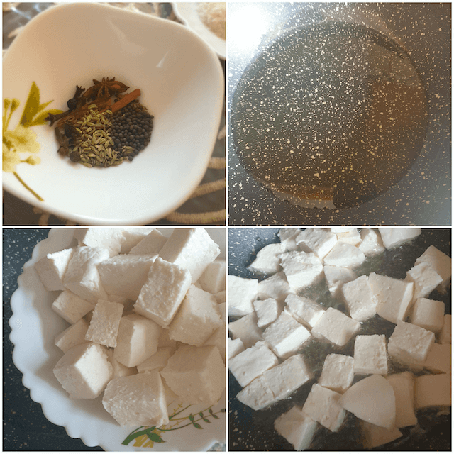
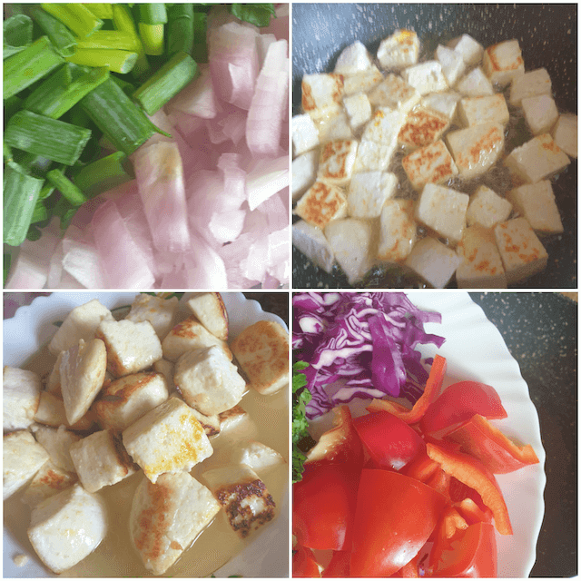
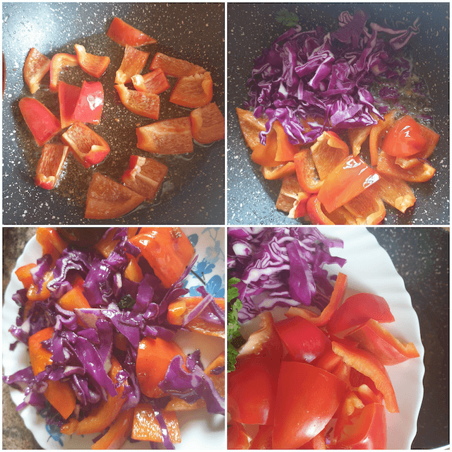
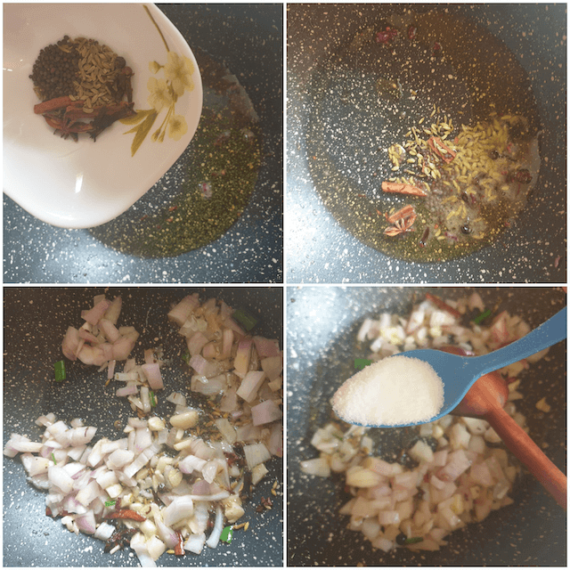
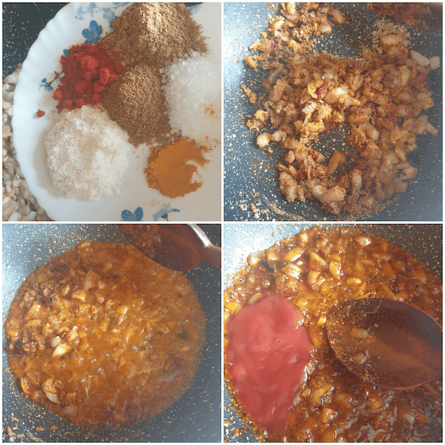
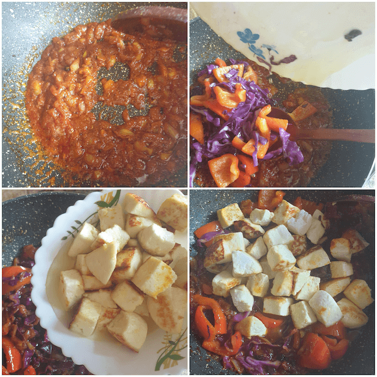
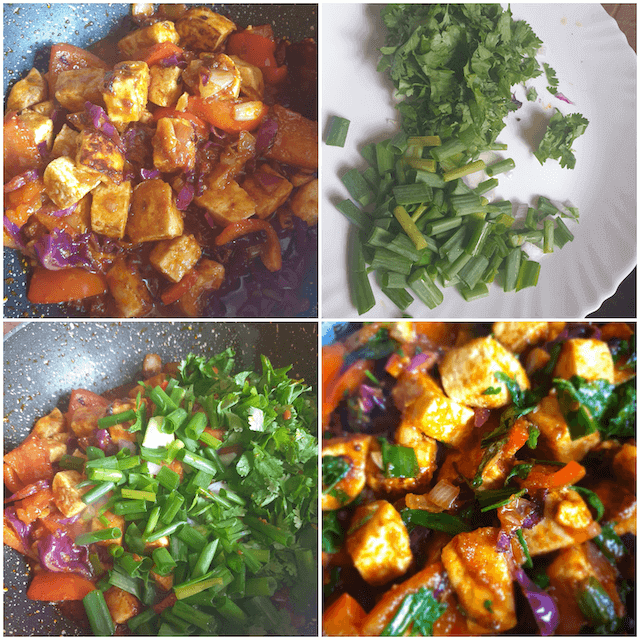
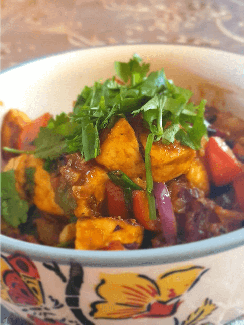

Paneer is one such ingredient that comes as a saviour when you need a quick and easy meal without having to go through the trouble of finding something delicious easy and quick to make and what is best is it goes great with both rice and chapatis, for the more calaorie conscious, just a bowl of paneer jhalfrezi can cover all the protein requirements with the goodness of veggies too.

 

India being a land where a large population is vegetarian, paneer becomes a very important source of protein, hence all through India paneer has several forms and a lot of dishes revolve around paneer as the base ingredient. 

 

Paneer jhalfrezi is one such dish that many believe to have originated in Bengal, where jhal means "spicy" and frezi comes from " porhezi" meaning to avoid , thus comes a dish that is not very spicy but beautifully colourful and rich in flavor with a dash of sweetness with its pinch of sugar that is essential to bengali cuisine.

 

 Its an extremely simple paneer curry dwelling along the lines of Indian method of cooking.

 

This recipe is one such recipe that can be made extremely colourful thanks to its flexibility of adding whatever colourful seasonal vegetables are available. It can also double up as a mixed vegetable curry where you can add all sorts of bell peppers, peas, corn, whatever you like and it would always taste just as delicious

 

So lets begin and yes do make sure to read the end notes 

 
 

{:title="Paneer Jhalfrezi"}

 
 

| Division     | Time    |
|--------------|---------|
| Prep Time    | 30 mins |
| Cook Time    | 10 mins |

 

Serves 6

 

|                       | Ingredient             | Quantity             |
|-----------------------|------------------------|----------------------|
| &#10003; |  Paneer                | 500gms               |
| &#10003; | Cumin seeds            | 1/2 teaspoon         |
| &#10003; | Cardamom               | 4 pods               |
| &#10003; | Cinnamon               | 1/2 inch             |
| &#10003; | Fennel seeds           |  1/2 teaspoon        |
| &#10003; | Cumin powder           | 1/2 teaspoon         |
| &#10003; | Corriander powder      |  1/2 teaspoon        |
| &#10003; | Turmeric powder        | 1/2 teaspoon         |
| &#10003; | Red chilli powder      |  1/2 teaspoon        |
| &#10003; | Salt                   | To taste             |
| &#10003; | Sugar                  | 1/2 teaspoon         |
| &#10003; | Garlic                 | 4 to 5 cloves minced |
| &#10003; | Spring onions          | 1 cup chopped        |
| &#10003; | Onions                 | 2 medium chopped     |
| &#10003; | Red cabbage            |  1/2 cup chopped     |
| &#10003; | Red/ yellow bell peper | 1/2 cup chopped      |
| &#10003; | Star annise            |  1                   |
| &#10003; | Coriander leaves       | 1/2 cup              |
| &#10003; | Mustard seeds          |  1/2 teaspoon        |
| &#10003; | Dessicated coconut     | 1/2 cup              |
| &#10003; | Cloves                 | 2 to 3               |
| &#10003; | Ketchup                | 2 tablespoons        |

 

**Method**{: .heading1 }

**Step 1:**{: .heading2 }

- Let us begin by chopping the ingredients so it saves time
- Chop the onions , coriander leaves, garlic, red bell peppers, spring onions, red cabbage
- Cut the paneer into pieces  
- Get the spices ready, red chilli powder, coriander, cumin ,sugar , turmeric powder and dessicated powder in clockwise order.

 
 

{:title="Ingredients Preparation"}

 
 

**Step 2:**{: .heading2 }

Shallow Fry the paneer in oil and set it aside , dipping in a little hot water is preferable as it keeps the paneer soft and melt in the mouth

 
 

{:title="Paneer Preparation"}

 
 

**Step 3:**{: .heading2 }

Shallow fry the red bell peppers and cabbage and remove from oil

 
 

{:title="Vegetable Preparation"}

 
 

{:title="Vegetable Preparation"}

 
 

**Step 4:**{: .heading2 }

- In the same oil,
- Put in the fennel seeds, mustard seeds, star annise , cloves and cinnamon stick
- Add the onions and saute lightly till the onions turn golden brown
- Add the salt

 
 

{:title="Onion Frying"}

 
 

**Step 5:**{: .heading2 }

- Add the spices and saute well
- Add the tomato ketchup and 1/2 cup water

 
 

{:title="Ingredients Frying"}

 
 

**Step 6:**{: .heading2 }

- Reduce the sauce and add the fried cabbage and red pepper
- Saute for 2 minutes and add the paneer

 
 

{:title="Mixing Ingredients"}

 
 

**Step 7:**{: .heading2 }

Lastly add the green onions and coriander leaves, cook for 2 minutes  

 

Paneer Jhalfrezi is ready

 
 

{:title="Final Paneer Jhalfrezi"}

 
 

The vibrant colors and homely flavours associate one with the happiness that food brings.
Indian curries in general comfort the soul and a dish like this helps in making both the tummy and  a tired body happy after a long day at work. It can also be served as a started and its sure to please anyone who tastes it. Be sure to try it the very next time you decide on making an easy and fast paneer dish.

 
 

{:title="final_paneer_jhalfrezi_bowl.pngPaneer Jhalfrezi"}

 
 

End notes  
1) The more the colours the better, you can use red, yellow , green bell peppers, red cabbage, carrots As you please.  
2) You can experiment with herbs like basil, parsley, celery.  
3) For vegan options paneer or cottage cheese can be replaced with tofu.  
4) The same can be made with soya chunks or fish, prawns or chicken and believe me it tastes amazing.  
5) Coriander and spring onions are the stars of this dish, so please try to include them.  

 
 

Thank you for your support, follow us on <a href="https://www.facebook.com/travelBiryani/" title="Travel Biryani Facebook" target="_blank" rel='external nofollow'> Facebook </a>, <a href="https://www.instagram.com/travelBiryani/" title="Travel Biryani Instagram" target="_blank" rel='external nofollow'> Instagram </a>
and <a href="https://twitter.com/travelBiryani" title="Travel Biryani Twitter" target="_blank" rel='external nofollow'> Twitter </a> and please do NOT forget to share our recipes.