**At times**{: .firstword} when we are bored of the same old rotis with our gravy, we can try something new. 

 

This is the easiest recipe which I have tried through trial and error, it is not the most authentic of recipes but yes it is really really delicious and very easy to make.
 You can skip the resting time of the dough if you are in a hurry too.

 

 Pita bread can be made with all purpose flour or with atta or with multigrain flour . We can play with the combinations and flavors.
 
 

It is a healthy option and can be indulged as per our wills and fancies
Go ahead and enjoy this amazing and simple recipe. Let me know how it turns up too.

 

|    Division  | Time   |
|--------------|--------|
| Prep Time    | 1 + 1/2 hrs |
| Cook Time    | 20 mins |

 

Serves 4

 

|                       | Ingredient | Quantity         |
|-----------------------|------------|------------------|
| &#10003; | Flour      | 2+1/2 cups       |
| &#10003; | Milk       | 1 cup warm       |
| &#10003; | Sugar      | 1 tablespoon     |
| &#10003; | Salt       | 1/2 teaspoon     |
| &#10003; | Yeast      | 2+ 1/2 teaspoon  |
| &#10003; | Water      | 1/2 cup warm     |
| &#10003; | Oil        | 2 tablespoon     |

 

**Method**{: .heading1 }

**Step 1:**{: .heading2 }
 
- Activate the yeast
- 1/2 cup warm milk + yeast 2+1/2 tablespoon + 1 tablespoon sugar and 1/2 teaspoon salt
- Make sure the milk is warm and not too hot as it would kill the yeast
- Keep aside for 5 mins to activate the yeast

 

Here we see how the yeast looks like once it gets activated

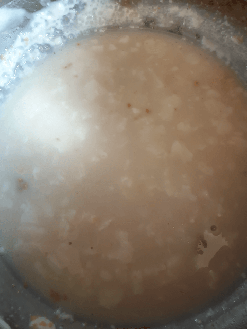{:title="Activated Yeast"}

**Step 2:**{: .heading2 }

In a large bowl

- Take 2 +1/2 cups flour
- Salt 1/2 teaspoon
- Oil 2 tablespoon

 

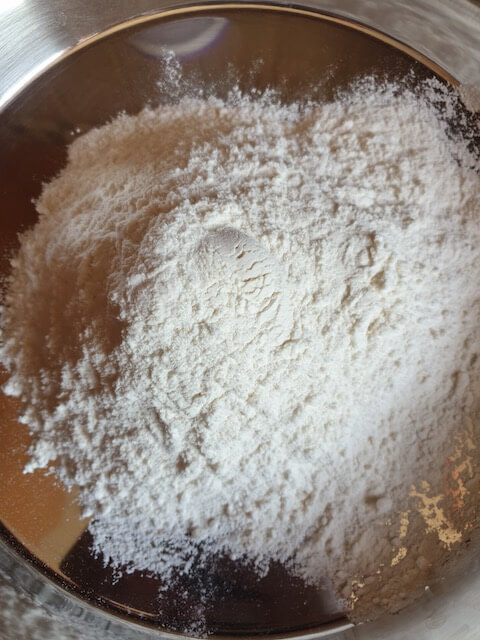{:title="Flour"}

 

 

The oil being added to the flour

 
 

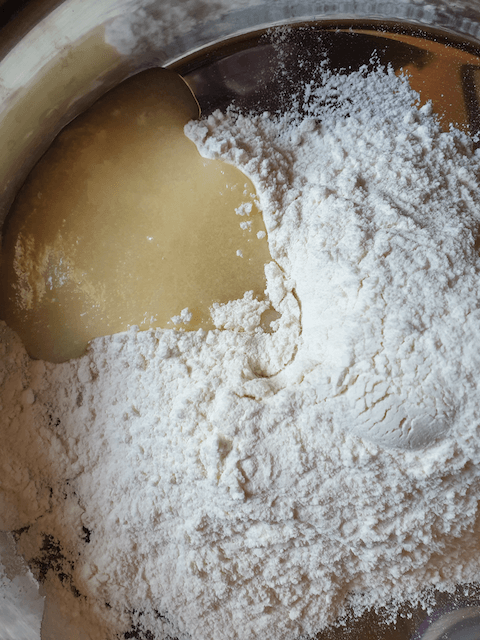{:title="Flour And Oil"}

 
 

Salt to taste.  
Along with the baking powder

 
 

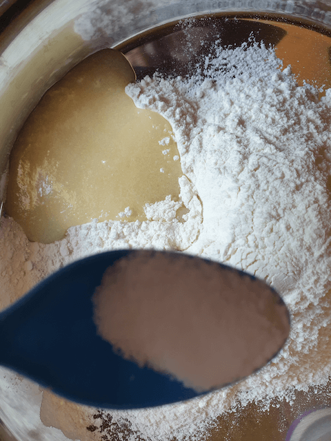{:title="Flour, Salt And Oil"}

 

**Step 3:**{: .heading2 }

- Mix the ingredients with the yeast mixture and knead well
- Add 1/2 cup water if needed
- Knead the dough well for 10 mins
- And set aside
- Cover the bowl with a wet muslin or kitchen cloth.

 

Yeast mixture 

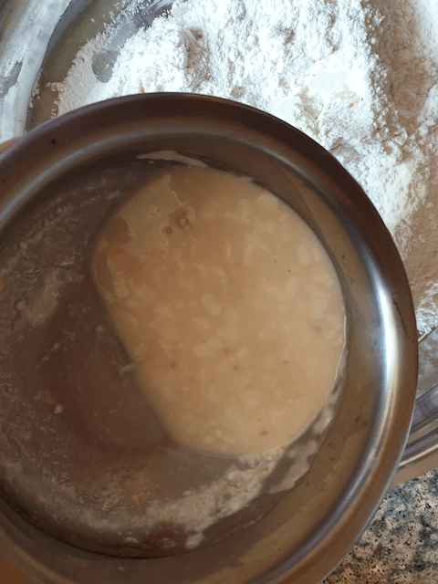{:title="Yeast mixture"}

 
 

Start kneading the dough well making sure to knead for atleast 10 mins

 
 

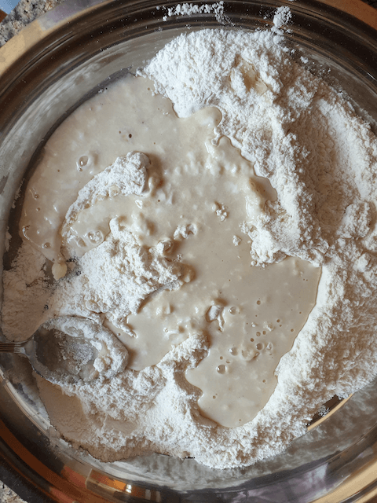{:title="Flour kneading"}

 
 

It should have a smooth consistency by the end of it

 
 

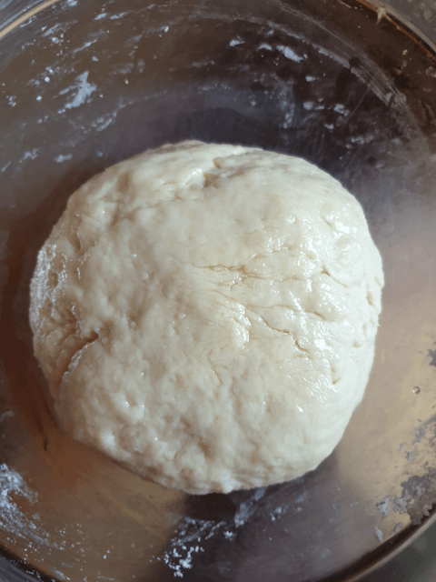{:title="Kneaded Flour"}

 
 

Rest the dough for 1 hr.  
Cover it with a moist cloth as it helps to retain the moisture and stops cracks from developing over the dough

 
 

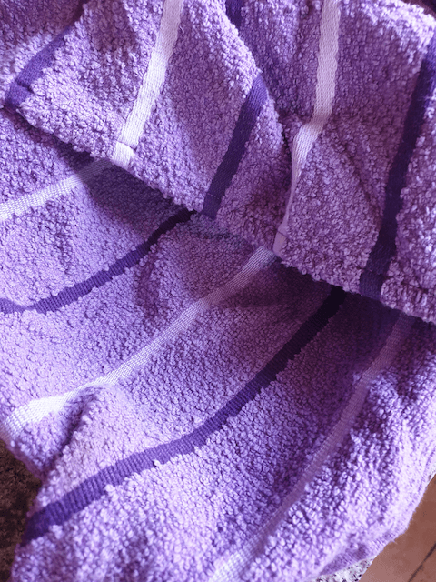{:title="Resting The Dough"}

 
 

After the dough is well rested make 8 equal sized balls out of it

 
 

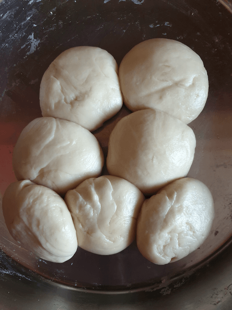{:title="Dough Balls"}

 

**Step 4:**{: .heading2 }

- Make 8 equal sized balls
- Roll the dough into 10 cms sized circles 
- Cook over low to high flame
- And smother with butter

 

The dough is rolled, as round as possible

 
 

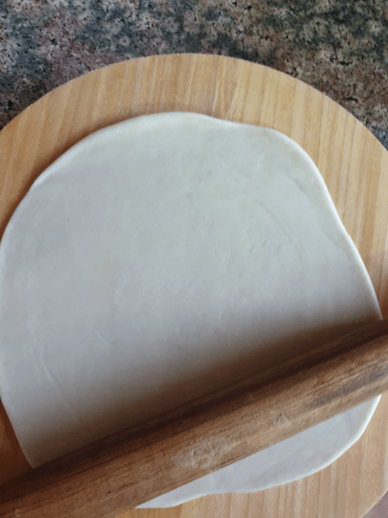{:title="Dough Rolling"}

 
 

In a flat tawa or pan cook the pita over a slow flame and apply butter or ghee as per your taste, you can skip the ghee as a healthier option

 
 

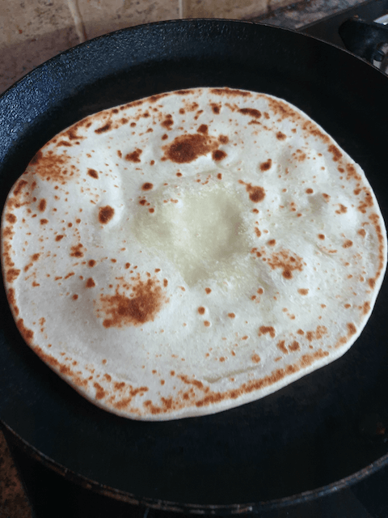{:title="Pita Cooking"}

 
 

Serve with chicken shorba

Here is a classy combination of the pita and chicken shorba.

 
 

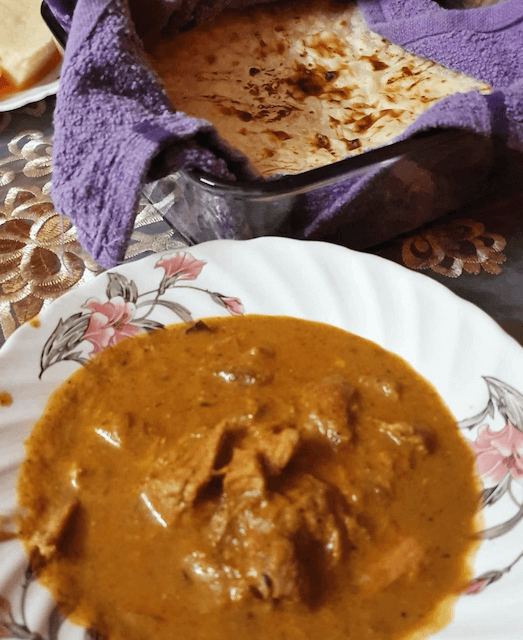{:title="Pita Serving"}

 
 

Be sure to eat them immediately it does not taste as good when it goes cold.

 

There are several variations of this bread from the middle east to greece and the entire south east asia. However, personally this is a recipe that i have found to be really really easy and goes really well with all types of indian gravies specially the spicy ones.

 

Try making it atleast once and I promise you will find all the work totally worth it

 

We will be back soon with another yummilicious recipe

 

Thank you for your support, follow us on <a href="https://www.facebook.com/travelBiryani/" title="Travel Biryani Facebook" target="_blank" rel='external nofollow'> Facebook </a>, <a href="https://www.instagram.com/travelBiryani/" title="Travel Biryani Instagram" target="_blank" rel='external nofollow'> Instagram </a>
and <a href="https://twitter.com/travelBiryani" title="Travel Biryani Twitter" target="_blank" rel='external nofollow'> Twitter </a> and please do NOT forget to share our recipes.

