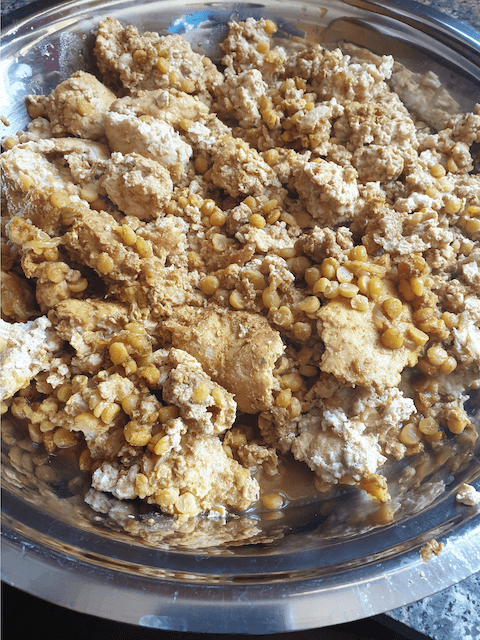
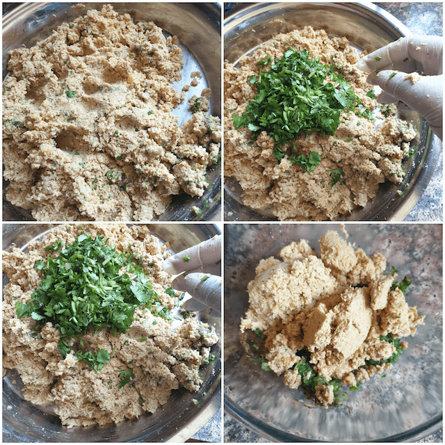

**Traditions live**{: .firstword} on with people, the culture ,the food and the taste.

 

Generations on end have enjoyed the beautiful taste of shami kebabs, the origins of which remain disputed till date.

 

Some say ,it was a gift brought in from the middle east by the Mughals, others retain that they originated from the royal kitchens of Awadh, but whatever it may be ,one thing stands clear ,it is a beautiful dish ,fit for royalty with its carefully chosen flavors and melt in the mouth meat.

 

Shami kebab is a dish that can be made with a wide range of ingredients, mutton shami kebab and chicken shami kebab remain most popular. The same can be made with tuna fish and it becomes a healthy fish shami kebab. When made with boiled eggs a healthy diet or gym shami kebab is also popular. Veg shami kebabs can be made from a variety of ingredients like paneer shami kebab, soya kheema shami kebab, tofu, jackfruit and plaintain , soon I shall bring to you recipe for veg shami kebabs.

 

Shami kebab banane ka tareeka kaafi aasan hai, bas thoda time lagta hai.  
(shami kebab is quiet easy to make however it takes a little time)

 

Shami kebab goes very well with mint chutney and imly or tamarind chutney.

 

Health wise, a better option remains to grill the shami kebab and gives you a good source of protein and healthy calories, not always do you have to sacrifice your taste buds to eat healthy.

 

Though this recipe is a complicated one however it has been my goal to make it as simple as possible , retaining the flavours that I best could...a simple kebab dish....a dish to please all your meat loving family and friends..

 

{:title="Chicken Shami Kebab"}

 
 

|    Division  | Time   |
|--------------|--------|
| Prep Time    | 30 mins |
| Cook Time    | 30 mins |

 
 

|                       | Ingredient              | Quantity                  |
|-----------------------|-------------------------|---------------------------|
| &#10003; | Chicken kheema          | 1kg                       |
| &#10003; | Chana dal or split gram | 250gms soaked overnight   |
| &#10003; | Onions                  | 2 medium                  |
| &#10003; | Coriander leaves        | 1 cup                     |
| &#10003; | Mint leaves             |  1 cup                    |
| &#10003; | One small onion         | For the coarse mince      |
| &#10003; |  Cinnamon powder        | 1 teaspoon                |
| &#10003; |  Cardamom powder        | 1 teaspoon                |
| &#10003; |  Chat masala            | 1 tbsp                    |
| &#10003; | Ginger paste            | optional                  |
| &#10003; | Garlic cloves           | 10                        |
| &#10003; | Lemon juice             | 1 lemon                   |
| &#10003; | White pepper powder     | 1tbsp or as to taste      |
| &#10003; | Garlic Powder           |  1 tbsp                   |
| &#10003; | Onion Powder            |  1 tbsp                   |
| &#10003; |  Kashmiri chili powder  | 1 1/2tbsp                 |
| &#10003; | Coriander powder        | 2 tbsp                    |
| &#10003; | Cumin powder            | 1 1/2 tbsp                |
| &#10003; | Turmeric powder         | 1 teaspoon                |
| &#10003; | Sugar                   | 1/4 teaspoon              |
| &#10003; | Salt                    | To taste                  |
| &#10003; | Oil                     | 2 to 3 tablespoon         |

 

**Method**{: .heading1 }

**Step 1:**{: .heading2 }
 
IN A PRESSURE COOKER COMBINE

- 1 KG of minced meat ( white meat or red meat as per taste)
- 250gms of soaked chana dal or split grams , preferably soaked overnight or minimum of 6 to 8 hrs
- 2 Medium onions
- 1 Tsp turmeric powder
- 1 1/2 tsp red chilli powder preferably kashmiri
- 2 tsp coriander powder
- 1 1/2 tsp jeera or cumin powder
- 1 Tsp turmeric powder
- 1 1/2 tsp red chilli powder preferably kashmiri
- 2 tsp coriander powder
- 1 1/2 tsp jeera or cumin powder
- Add 1 cup or 250 ml of water( remember the chicken leaves water )

 

Close the lid and let it whistle away to glory.... for a good 8 to 10 whistles.....

 

{:title="Minced Chicken"}

 
 

{:title="Soaked Spilit Grams"}

 
 

{:title="mix spices"}

 
 

{:title="mix spices"}

 
 

{:title="mix spices"}

 
 

{:title="mix spices"}

**Step 2:**{: .heading2 }

As the cooker gets on with its whistling....let us start with the chopping issue

 

In a blender add

 
 

{:title="mix herb"}

 
 

- Mint leaves 1 cup
- Coriander leaves 1 cup
- 10 cloves of garlic
- 1 medium onion

 

And blend well
This is how it should look like

 
 

{:title="blended mix herb"}

 
 

Now to the above mix we combine

 

1 teaspoon cardamom and cinnamon powder each

 
 

{:title="blended mix herb"}

**Step 3:**{: .heading2 }

Now once the meat is done cooking , cool it down and transfer it to a large flat bottomed mixing pan

 

It should look like this

 
 

{:title="cooled minced mix"}

 
 

To that we add around 2 tablespoon of vegetable oil, I personally prefer sunflower oil,but it tastes best with mustard oil.

 
 

{:title="cooled minced mix"}

 
 

We combine it well and then blend the entire content in a food processor or blender

 
 

{:title="cooled minced blend"}

**Step 4:**{: .heading2 }

We now combine the meat to the ingredients in step 2

 
 

{:title="combined chicken shami kebab mix"}

We also add a cup of coriander leaves again for an extra bite,at this stage we can aslo add the store bought shaami kebab masala, I personally skip that,you can also add javitri or jaiphal powder.

 

One must is aamchur or chaat masala powder.....

 

Which i have added but have forgotten to click....

 

Sorry about that  

 

About 1 tsp of chaat masala powder is added.

 

**Step 5:**{: .heading2 }

Now shape them into 4 cms circular discs  

The best part about this is,I make them and freeze them for upto a month and I use it directly without thawing , just shallow fry them straight up from the freezer

 
 

{:title="shaping chicken shami kebab"}

 
 

**Step 6:**{: .heading2 }

Shallow fry them with very little oil in a large nonstick pan for approximately 3 mins on each side,

 

It can also be microwaved for 2 mins for a healthier option....

 

{:title="frying chicken shami kebab"}

This is your shammi kebab ready.

 

And believe me alllll that work is well worth it.

 

As a kid I remember helping my grandmom make it, it has always been an Eid specialty , or Eid Shami kebab, we all loved it as children and do so still.
Phewwww..... yum yum

 
 

{:title="chicken shami kebab"}

 
 

Thank you for your support, follow us on <a href="https://www.facebook.com/travelBiryani/" title="Travel Biryani Facebook" target="_blank" rel='external nofollow'> Facebook </a>, <a href="https://www.instagram.com/travelBiryani/" title="Travel Biryani Instagram" target="_blank" rel='external nofollow'> Instagram </a>
and <a href="https://twitter.com/travelBiryani" title="Travel Biryani Twitter" target="_blank" rel='external nofollow'> Twitter </a> and please do NOT forget to share our recipes.....

