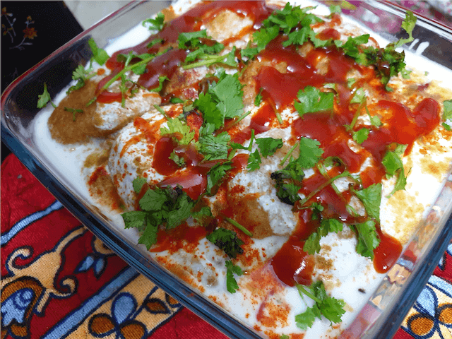

Dahi vada or an Indian style dumpling  is a very popular snack eaten all around India, Pakistan, Bangladesh and parts of Sri lanka. Although now it is consumed mostly as a snack but it has had very important and logical reasons for being consumed around these places and a very logical explanation for the same.

 

Due to the hot tropical environment, curd and youghurt are consumed in various ways in these areas for its cooling and soothing effect. Dal in most its forms have very high protein content and most people in ancient times have been heavy workers and also vegetarians, so how did they cover their nutritional requirements and at the same time find something easy refreshing and tasty???

 

Well the answer to this was dahi vada, that has many many different varities and is an ancient dish. It is also consumed during vraths (fasts) and has Rajasthani dahi vada and Gujrati dahi vada recipe variations also. Well also it is consumed largely during the holy month of Ramadan

 

This easy to make dahi vada recipe that my nani taught me is a slightly sweet dahi vada recipe and after reading a lot about the different recipes and variations, I realised that this recipe is indeed a very tasty and easy to replicate one. 

 

Although dahi vada is made of moong dal, urad dal or besan also in different variations, this variation incorporates urad dal with a little bit of flour and I guess it makes the softest dahi vada I have ever come across.

 

So lets begin this yummilycious, easy to make and party pleaser dahi vada recipe.

 

| Division       | Time    |
|----------------|---------|
| ASSORTING TIME | 10 mins |
| PREP TIME      | 25 mins |
| COOKING TIME   | 10mins  |

 

Serves 4-8 (makes around 20 vadas)

 

{:title="Dahi Vada Cover"}

 

**Ingredients**{: .heading1 }

 

|                       | Ingredient         | Quantity                                                                                                                                           |
|-----------------------|--------------------|----------------------------------------------------------------------------------------------------------------------------------------------------|
| &#10003; | Urad Dal           | 250 grams (soaked overnight)                                                                                                                       |
| &#10003; | Curd/ Yoghurt      | 800 ml                                                                                                                                             |
| &#10003; | Coriander leaves   | Chopped 1 cup                                                                                                                                      |
| &#10003; | Oil                | 250 ml for deep frying                                                                                                                             |
| &#10003; | Water              | 200 ml (for diluting curd) + 500ml (for soaking the vadas)                                                                                         |
| &#10003; | Chat masala        | 2 tablespoon                                                                                                                                       |
| &#10003; | Sev ready made     | 1 cup                                                                                                                                              |
| &#10003; | Green chutney      | 100 ml (blend half cup mint leaves or coriander leaves with a teaspoon of sugar , 2 green chillies, a 2 inch piece of tamarind and salt to taste)  |
| &#10003; | Imli chutney       | 100ml ( store bought or boil a cup of tamarind pulp with 2 tablespoon of sugar, 1 whole red chilli, a teaspoon of fennel seeds and salt  to taste) |
| &#10003; | Sugar              | 2 tablespoon                                                                                                                                       |
| &#10003; | Salt               | As per taste                                                                                                                                       |
| &#10003; | All purpose flour  | half cup                                                                                                                                           |
| &#10003; | Baking powder      | half teaspoon                                                                                                                                      |
| &#10003; | Red chilli powder  | A pinch for garnish                                                                                                                                |
| &#10003; | Ketchup            | half cup                                                                                                                                           |

 

**Method**{: .heading1 }

**Step 1: Getting the urad dal ready For Dahi Vada**{: .heading2 }

- Take 250 grams of urad dal, wash well, add around a litre of water and soak well overnight, I have seen that soaking for around 4 to 6 hrs also does the trick.
- Now in a blender, or food processor, add the urad dal with 2 cups of water and blend well until smooth or until all the graininess of the urad dal goes and it becomes a soft consistency.
- Now leave it for 2 hrs to ferment.

 
 

{:title="Making batter"}

 
 

**Step 2: Preparing the final batter for the Vadas**{: .heading2 }

- After two hours check the consistency of the batter.
- Add salt to taste, baking powder and half cup of all purpose flour (you can also add gram flour or besan but I have seen that it alters the taste and the colour of the vadas, so i refrain from using that but a little flour does the trick)
- Once all these  are mixed well, leave it for 15 mins to rest
- Next heat a deep bottomed pan and get the oil to heat.
- Once the oil is heated get a laddle and pour out the batter and fry as shown.

 
 

{:title="Final Batter"}

 
 

**Step 3: Getting the solution to soak the vadas ready**{: .heading2 }

- This is a relatively easy but confusing step, well i will try making it easy.
- As the vadas fry, get two dishes ready, the one you want to serve your vadas in and the other one, a normal bowl would do.
- Lay them next to each other
- Place the normal bowl to the left and add 3 cups of cold water to that, then add two spoons of sugar to that and dissolve it well.
- Next to that place the dish you want to serve it in.
- Now once the vada is fried, keep it on a normal plate and immediately put it in the bowl of cold water with the sugar solution.
- Repeat with all the vadas.

 
 

{:title="Frying and Dipping"}

 
 

**Step 4: Assorting and layering the Dahi Vada**{: .heading2 }

- Well now we get the curd ready, pour out the curd into a large bowl, add 1 teaspoon of sugar and half cup of water to lighten it.
- Next pour the curd to cover the first layer of vadas.
- Once that is done, pour a layer of ketchup, imli sauce , coriander leaves , a pinch of chat masala and green chutney on top of that, place the next layer of vadas and repeat the step with the remaining vadas.

 
 

{:title="Dahi Mix"}

 
 

Repeating the layering process.

 
 

{:title="Layering"}

 
 

**Step 5:  Final Layering**{: .heading2 }

- Once final layer is done, garnish religiously with the coriander leaves, imli and green chutney and chaat masala powder, also use a pinch of red chilli powder for extra taste and colour.

 
 

{:title="Final Assorting"}

 
 

Finally add the sev or bhujia and well the dahi vada is ready to be served.

 
 

{:title="Final Vada"}

 
 

Sooooo this is how it looks finally  
I have fed almost 20 people with this, it turns out brilliant every single time  
Nani would make it on eid and I would always look forward to it.  
Hope you guys try and let me know.  

 
 

Here are few commonly asked questions about this recipe and I have tried my best to answer them for you

 

**Question 1: How do I make soft dahi vadas? My dahi vada turns hard, how to make them soft?**{: .heading2 }  
Firstly, I have experimented and found that urad dal dahi vadas turn up the softest, if the batter is too soft add a little all purpose flour and its good to go.  
Secondly, soaking the urad dal for 8 hrs really helps. Thirdly, after the vadas are fried, dip them in the water within a minute and soak for not more than 30 seconds.  
And lastly, grinding the batter very smooth also helps.

 
 

**Question 2: My batter is too thin , the vadas break easily, how do I fix it?**{: .heading2 }  
Well its easy, add a little bit of all purpose flour according to the proportion of your flour, rest it for 15 mins and you are good to go.

 
 

**Question 3: Can I eat dahi vada if i have lactose intolerence or if I am vegan?**{: .heading2 }  
There are a variety of curds that are available these days, trying using coconut milk curds which is an amazing vegan option and good for lactose intolerance too.

 
 

**Question 4: Can I eat dahi vada when on a diet?**{: .heading2 }  
Dahi vada is an amazing option when in a diet, because it is packed with proteins and is filling too ,just alter the deep fried vadas with baked ones and you are good to go.

 
 

**Question 5: How can I make vadas more appealing to my kids?**{: .heading2 }  
Try making little cute vadas and decorating them with a lot of ketchups and coriander. My daughter loves it.

 
 

**Question 6: Can it feed a large crowd?**{: .heading2 }  
This recipe is actually very very handy when it comes to feeding large crowds, because you can always make it ahead and chill. You can keep and consume it for upto 5 days

 
 

**Question 7: Can vadas be made with rice powder?**{: .heading2 }  
Rice powder can be added yes to make the batter a better consistency but no you cant make it with rice powder as the base. It does not turn out that great.

 
 

**Question 8: Can I freeze dahi vada?**{: .heading2 }  
Yes you can totally freeze the vadas in a zip lock pouch and store it in the freezer and just refry or thaw and you are ready to go the next time you wanna assort it.

 
 

**Question 9: Are dahi vada and dahi bhalla the same thing?**{: .heading2 }  
Answer is yes, dahi vada is the name given to it in southern parts of India, whereas in North India its called Dahi bhalla.

 
 

**Question 10: Does dahi vada increase weight?**{: .heading2 }  
Not really, dahi vada is a relatively healthy dish.

 
 

Thank you for your support, follow us on <a href="https://www.facebook.com/travelBiryani/" title="Travel Biryani Facebook" target="_blank" rel='external nofollow'> Facebook </a>, <a href="https://www.instagram.com/travelBiryani/" title="Travel Biryani Instagram" target="_blank" rel='external nofollow'> Instagram </a>
and <a href="https://twitter.com/travelBiryani" title="Travel Biryani Twitter" target="_blank" rel='external nofollow'> Twitter </a> and please do NOT forget to share our recipes.