Prawns are , according to me the yummiest gift from the sea, prawns are my personal favourite seafood , it takes minimal efforts to cook and the taste it imparts is totally out of the world.

 

Prawns have been eaten all over the world and in India it has been popular in the entire coastal areas , each area have their own ways of cooking them like the Malabar prawns curry from Kerala, the prawns Chettinad from the Chettinad region of Andhra ,prawns vindaloo from Goa, Prawns Ghee roast from Dakshina Kanada and the famous Daab Chingri from Bengal.

 

This here is a very easy take on the coconut prawn curry which goes well as a weekday meal as it is ready  in no time and with minimal effort.

 

I have been eating it since childhood, my grandma would make this often and this is her recipe, we would eat it with rice and a piece of lemon and green chilli.

 

The waft of fried prawns would fill my home and I would totally look forward to dinner time.

 

Prawns are rich in vitamins B6 and B12 and has significant amounts of iron. It is Infact really healthy.

 

This is one of the best prawn curries you can make with the least ingredients and is easy enough for beginners to make too.

 

You can adjust the spice level of this curry as per your taste, you can make it into a spicy prawn curry or leave it bland, its totally upto you.

 

The texture of coconut and the taste of the plump prawns make this dish totally worth it, the flavours are amazing and you will totally love it

 

If you want to learn how to cook a good prawn curry, look no further.  
Lets begin

 
 

|    Division  | Time    |
|--------------|---------|
| Prep Time    | 15 mins |
| Cook Time    | 15 mins |

 

Serves 4 - 8

 

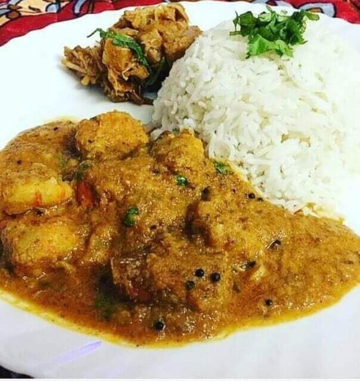{:title="Coconut Prawn Curry"}

 

**Ingredients**{: .heading1 }

 

|                       | Ingredient                                       | Quantity                                          |
|-----------------------|--------------------------------------------------|---------------------------------------------------|
| &#10003; | Tiger prawns                                     | 1 kg, around 500 to 600 gms remain after cleaning |
| &#10003; | Onions                                           | 2 medium/ chopped                                 |
| &#10003; | Tomatoes                                         | 1 medium/ chopped                                 |
| &#10003; | Garlic cloves                                    | 7 to 8 cloves                                     |
| &#10003; | Coriander leaves                                 | 1/3 cup chopped                                   |
| &#10003; | Green chillies                                   | 1 or 2                                            |
| &#10003; | Fresh or dessicated coconut as per availability  | 1 cup                                             |
| &#10003; | Mustard seeds                                    | 1 teaspoon                                        |
| &#10003; | Red chilli powder                                | 1 teaspoon                                        |
| &#10003; | Turmeric powder                                  | 1 teaspoon                                        |
| &#10003; | Salt                                             | As per taste                                      |
| &#10003; | Sugar                                            | 1/2 teaspoon                                      |
| &#10003; | Cinnamon                                         | 1/2 inch broken to pieces                         |
| &#10003; | Cardamom                                         | 5 to 6 pods                                       |
| &#10003; | Black cardamom                                   | 1 large                                           |
| &#10003; | Garam masala powder                              | 1/2 teaspoon                                      |
| &#10003; | Oil                                              | 2 tablespoons                                     |
| &#10003; | Chicken or fish masala                           | 1/2 teaspoon (optional)                           |
| &#10003; | Lemon                                            | Juice of 1 medium sized lemon                     |
| &#10003; | cloves                                           | 5 to 6                                            |
| &#10003; | Tamarind                                         | A ball of 2 cms                                   |

 

**Method**{: .heading1 }

**Step 1: Getting the masalas in order for Coconut Prawn Curry**{: .heading2 }

 
 

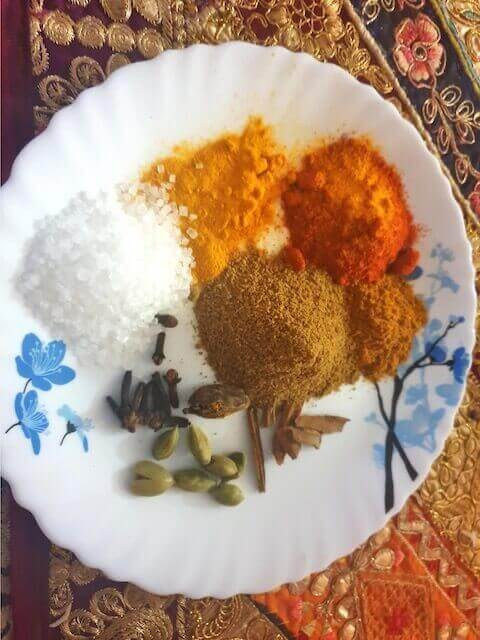{:title="Coconut Prawn Masalas"}

 
 

**Step 2: Chopping the basic ingredients and getting the coconut paste ready for Coconut Prawn Curry**{: .heading2 }

- Roughly chop the garlic, onions and tomatoes.

 
 

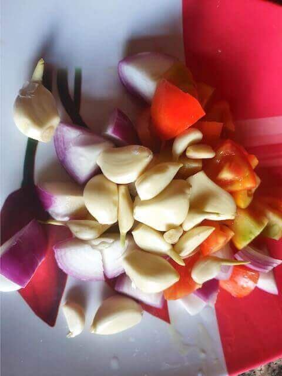{:title="Coconut Prawn Masalas"}

 
 

Next, in a blender add dessicated coconut or fresh coconut 1 cup, with a spoon of mustard seeds, 1 whole green chilli,tamarind and 1/2 cup water,blend it into a fine paste.

 
 

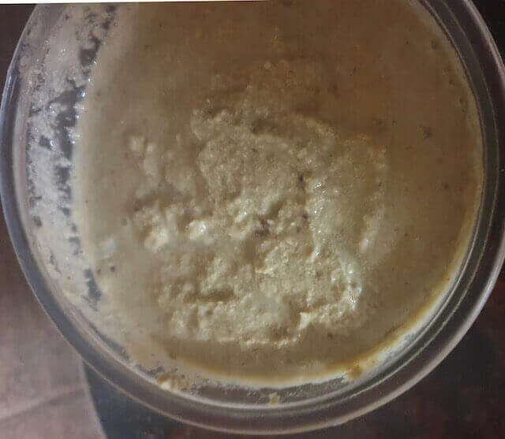{:title="Coconut Paste"}

 
 

**Step 3: Preparing the prawns for Curry**{: .heading2 }

- Thoroughly wash and clean the prawns

 
 

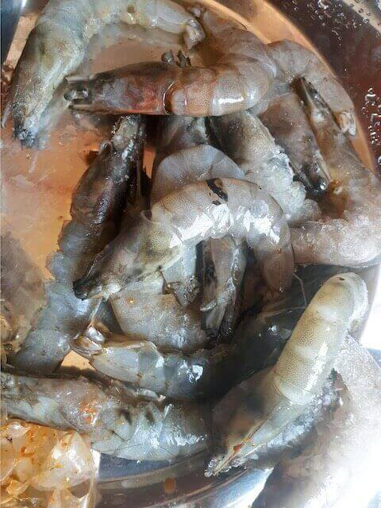{:title="Prawns"}

 
 

Marinate it with a teaspoon of turmeric, red chilli powder and salt and leave it aside for 10 mins(optional)

 
 

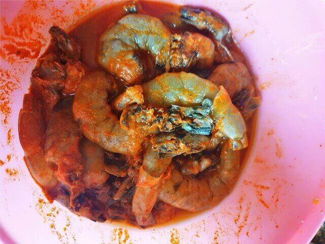{:title="Marinated Prawns"}

 
 

**Step 4: Getting the onion and tomato paste ready and starting the prawn curry**{: .heading2 }

- Slightly fry the onions tomatoes and garlic with very little oil and then blend it into a paste
- Next shallow fry the prawns for 2 minutes, remove from oil
- Then add the garam masala viz cloves, cinnamon, cardamom and black cardamom to the oil, fry until they release their aroma.

 
 

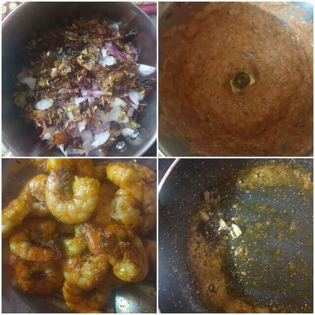{:title="Starting the Coconut Prawn Curry"}

 
 

**Step 5: Frying the masalas for Prawn Curry**{: .heading2 }

- Once the aromas of the garam masala release, add the onion paste and fry the masala very well
- Next add the salt, sugar, chicken masala and garam masala powder and fry for another minute or until the masala releases oil.

 
 

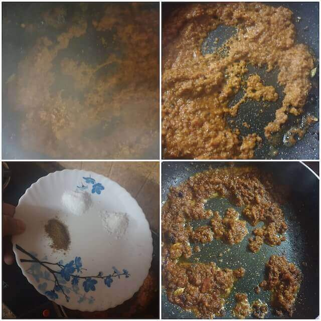{:title="Coconut Prawn Curry Frying Masala"}

 
 

**Step 6: Adding the coconut paste**{: .heading2 }

- Add the coconut paste already prepared and mix it thoroughly.
- Once it incorporates well, add the prawns

 
 

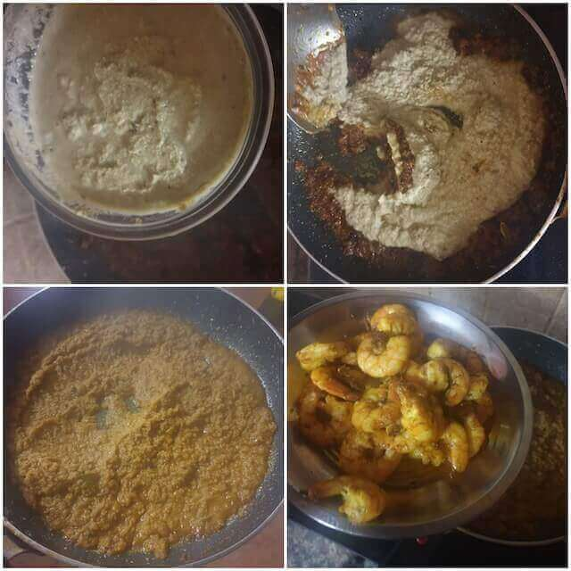{:title="Adding Coconut Paste"}

 
 

**Step 7: Mixing the prawns**{: .heading2 }

- Mix the prawns well with the masala
- Add 1 cup or 250ml of water, preferably warm water , cover it and let it simmer until the prawns are done for 5 to 7 minutes
- Add the juice of one lemon, mix well and its ready
- You can also use 1/2 teaspoon vinegar instead of lemon juice.

 
 

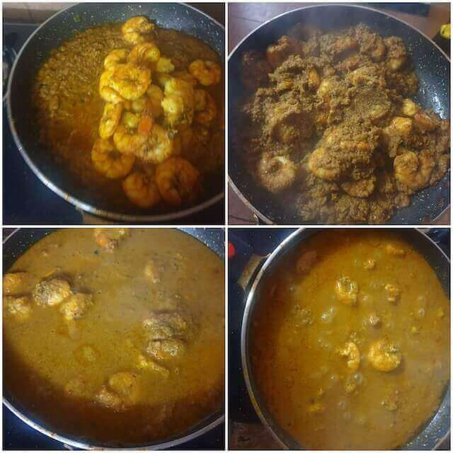{:title="Mising Prawns With Curry"}

 
 

Garnish with coriander leaves and your coconut prawn curry is ready , a plate of hot steaming white rice and the prawn curry are friends for life.

 
 

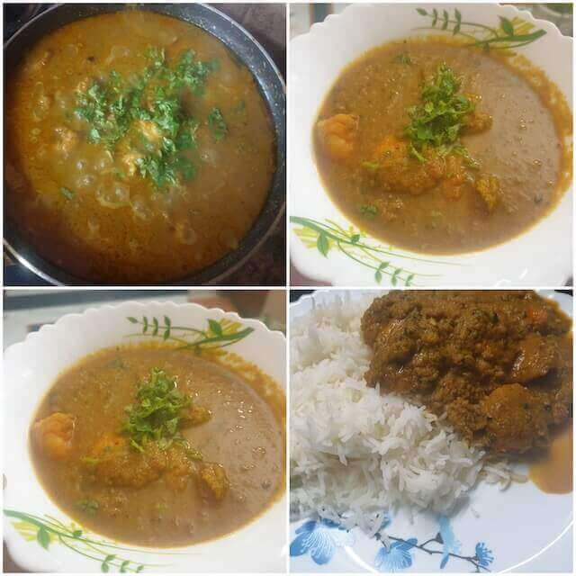{:title="Coconut Prawn Curry Final"}

 
 

**ALLERGEN WARNING- CONTAINS PRAWNS**{: .heading1 }

Here are few commonly asked questions about this recipe and I have tried my best to answer them for you

 

**Question 1: What is the difference between prawns and shrimp?**{: .heading2}  
They are just anatomically different species, however they taste no different, in some places shrimp are said to be sweeter.

 
 

**Question 2: Do prawns cause allergy?**{: .heading2}  
A recent study shows that 1 in 100 people have a seafood allergy, so it is advisable to get the allergen test done if you are unsure, some people get urticarial rashes, some get more severe form of allergies like anaphylactic shocks and laryngeal and angio oedema. Hence always get tested if you are new to eating seafood.

 
 

**Question 3: How to remove the smell from prawns?**{: .heading2}  
Washing the prawns with a little bit of vinegar or marinating it for 10 to 15 minutes in vinegar helps to remove the smell.

 
 

**Question 4: Do I always need to devein the prawns?**{: .heading2}  
Deveining prawns is a matter of aesthetics and keeping it intact does not alter the flavours in any way.

 
 

**Question 5: Are black prawns safe to eat?**{: .heading2}  
Black spots occur when the shell on the prawns begin turning black within hours or days of harvesting ,this is due to an enzyme process causing oxidation in the prawns , just like apples oxidise after cutting them, its not harmful however it does not look appealing, that is all.

 
 

**Question 6: How to get the maximum flavour from prawns?**{: .heading2}  
Lightly sealing the prawns in oil over low flame before the actual cooking process helps to release maximum flavours from the prawns. This is something my grandma taught me.

 
 

**Question 7: Can prawns be eaten raw?**{: .heading2}  
Though in some places prawns are eaten raw, it is advisable not to as raw prawns may contain the bacteria Salmonella. Cooking them thoroughly before consumption is advisable.

 
 

**Question 8: Can  I eat it when on a diet?**{: .heading2}  
Prawn is a lean source of protein and are low on fat with only 0.5 grams of fat per 2 ounce serving, prawns are a rich source of unsaturated fat that can improve the overall health, if you are trying to loose weight , it is the perfect low fat food choice.

 
 

**Question 9: Can prawns be eaten during pregnancy?**{: .heading2}  
Yes prawns are a great source of iron and hence is good to be eaten during pregnancy, however make sure that it is thoroughly cooked.

 
 

**Question 10: What are the nutrients in prawns?**{: .heading2}  
Prawns are rich in Vitamin B-6 and B12 and the amino acid niacin known for its collagen boosting properties and it also contains iron which is important for the RBCs.

 
 

Thank you for your support, follow us on <a href="https://www.facebook.com/travelBiryani/" title="Travel Biryani Facebook" target="_blank" rel='external nofollow'> Facebook </a>, <a href="https://www.instagram.com/travelBiryani/" title="Travel Biryani Instagram" target="_blank" rel='external nofollow'> Instagram </a>
and <a href="https://twitter.com/travelBiryani" title="Travel Biryani Twitter" target="_blank" rel='external nofollow'> Twitter </a> and please do NOT forget to share our recipes.