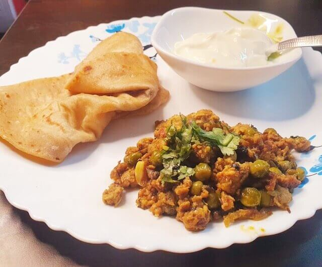
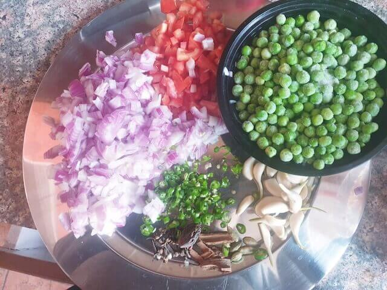
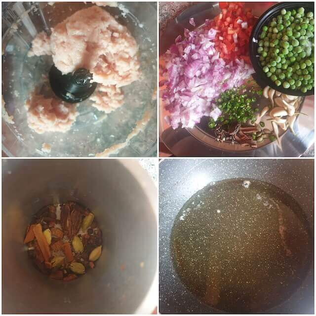
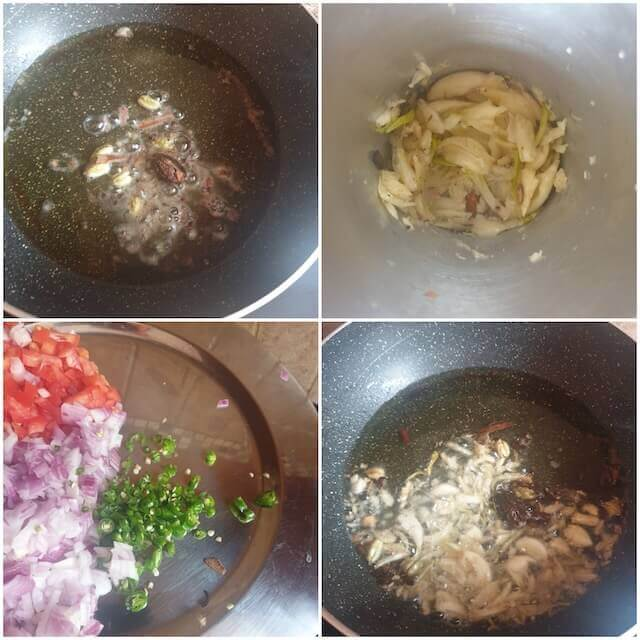
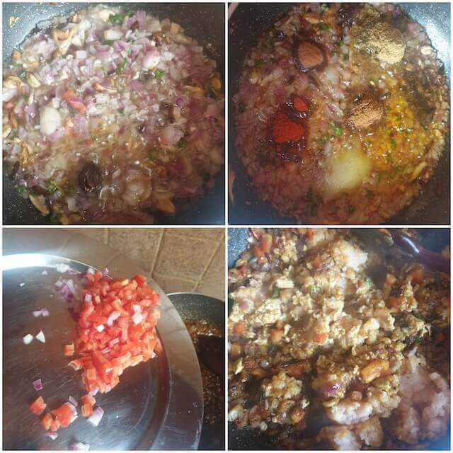
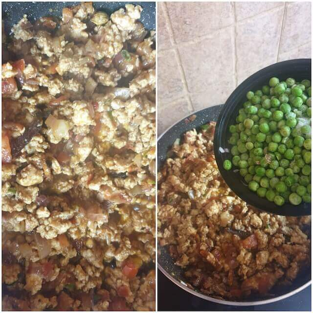
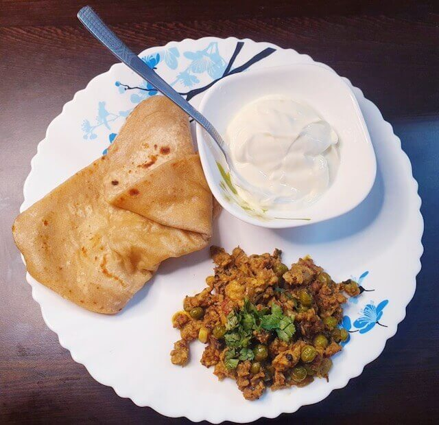

Keema Matar is one of the most famous minced meat dishes in the subcontinent of India. It goes amazingly well with everything from Rumali Rotis to Tawa Chapatis and Paranthas to Pulao.

 

 A mouthful of Keema Matar has a soft, smooth texture and bite to it along with a burst of flavours.

 

 It is an expectionally delicious meal when cooked perfectly with the right amount of spices is a joy to the palate.

 

Keema Matar is a go-to dish for grand occasions as well as a decent family get together dinner. 

 

Easy and fast to prepare, keema matar delivers the maximum taste and satisfaction with minimal effort and fuss.  
Also it is a dish which is great for those who are beginners as cooks.take a test at being a chef with this dish.

 

Something to woo your dinner dates,

 

It makes for a great option when you are entertaining guests over the weekday since it cooks exceptionally fast.

 

You can adjust the spices according to your liking.
It also makes a great stuffing for buns and parathas.

 

It makes a great healthy food option because it can be made completely without any oil too and gives the right nutrition and proteins without compromising on the taste.

 

So what are we waiting for lets get started with this easiest of the easy recipe

  

|  Division    | Time    |
|--------------|---------|
| Prep Time    | 10 mins |
| Cook Time    | 10 mins |

 

Serves 4 - 8

 

{:title="Keema Matar"}

 

**Ingredients**{: .heading1 }

 

|                        | Ingredient          | Quantity              |
|------------------------|---------------------|-----------------------|
| &#10003;  | Chicken keema       | 500gms                |
| &#10003;  | Onions              | 4 medium chopped      |
| &#10003;  | Tomatoes            | 2 medium/ chopped     |
| &#10003;  | Cardamom            | 5 pods                |
| &#10003;  | Cinnamon            | 2 inch                |
| &#10003;  | Cloves              | 5 whole               |
| &#10003;  | Black cardamom      | 2 whole               |
| &#10003;  | Garlic              | 1 whole chopped       |
| &#10003;  | Green chillies      | 6 chopped             |
| &#10003;  | Peas                | 300gms to 400gms      |
| &#10003;  | Salt                | To taste              |
| &#10003;  | Red chilli powder   | 2 teaspoons           |
| &#10003;  | Turmeric powder     | 1 teaspoon            |
| &#10003;  | Coriander powder    | 3 teaspoons           |
| &#10003;  | Cumin powder        | 1 1/2 teaspoons       |
| &#10003;  | Amchur powder       | 1 teaspoon            |
|  &#10003; | Garam masala powder | 1 teaspoon            |
| &#10003;  | Oil or ghee         | 3 tablespoons         |
| &#10003;  | Corriander leaves   | 2 cups chopped        |
| &#10003;  | Sugar               | A pinch               |
| &#10003;  | Cinnamon powder     | 1/2 teaspoon optional |

 
 

{:title="Keema Matar Ingredients"}

 
 

**Method**{: .heading1 }

**Step 1: Getting the ingredients ready For Keema Matar**{: .heading2 }

- If you have ready made kheema , that is great, if not put boneless chicken into a blender and blitz it for 2 minutes
- Chop the onions, garlic ,tomatoes , green chillies ,coriander leaves and keep it aside.
- Bruise the cardamoms, cinnamons, black cardamoms, pepper and cloves in a mortar and pastel
- Set aside the coriander powder, chilli powder, jeera powder, cinnamon powder, turmeric powder, garam masala, garlic powder, salt to taste. 

 
 

{:title="Keema Matar Ingredients"}

 
 

**Step 2: Cooking Keema Matar**{: .heading2 }

- In a wide pan heat the oil or ghee
- Add the garam masalas that we bruised earlier
- Add the garlic until it turns brown
- Add the green chillies and chopped onions

 
 

{:title="Keema Matar Cooking"}

 
 

**Step 3: Adding the masalas for Keema Matar**{: .heading2 }

- Once the onions cook through for 2 to 3 minutes, add the turmeric powder.
- Followed by the coriander powder, chilli powder, jeera powder, cinnamon powder, garam masala, garlic powder, salt to taste.
- Once the masalas are incorporate well, add the tomatoes.
- Now add the kheema and fry through very well.

 
 

{:title="Keema Matar Adding Masala"}

 
 

**Step 4: Cooking the chicken through For Keema Matar**{: .heading2 }

- Once the chicken cooks through well, add the peas and cover and cook on medium flame for 5 minutes
- Now add the chat masala powder or amchur powder and the coriander leaves
- Add in the garam masala powder and cinnamon powder.
- Simmer for another 2 to 4 minutes or till the peas soften a little and you are ready to go.

 
 

{:title="Keema Matar Adding Peas"}

 
 

The best thing ever to go with hot steaming parathas and a bowlful of rich creamy yoghurt to counter the heat from the kheema, enjoy the ultimate soul food.

 
 

{:title="Keema Matar Final"}

 
 

Here are few commonly asked questions about this recipe and I have tried my best to answer them for you

 

**Question 1: How to make an easy dish with keema?**{: .heading2}  
Keema matar is the easiest dish to make with keema.

 
 

**Question 2: How to increase the quantity of your chicken?**{: .heading2}  
when you are cooking with limited supplies, you got to be smart at times and adding peas to the keema adds to the richness of the curry and increases the quantity too.

 
 

**Question 3: How to feed large crowd 1 kg chicken?**{: .heading2}  
Feeding a large crowd with limited supplies is so very easy, keema matar is the answer, you can double the amount of peas and keep the quantity of chicken as it is and there will really not be much alteration to the quality or taste of the dish.

 
 

**Question 4: How to make a bun filling?**{: .heading2}  
Keema matar works as a delicious bun filling too go ahead and try it someday.

 
 

**Question 5: Is keema matar healthy?**{: .heading2}  
Yes, keema matar can be made with really little to no oil too and is a terribly healthy option for your protein requirements with the goodness of peas as green veggies too.

 
 

**Question 6: Can I eat keema matar when on a diet?**{: .heading2}  
Yes, keema matar makes for a great option when on a diet , with one sukhi roti or plain chapati, it gives the nutrition you need and is filling too.

 
 

**Question 7: What is keema matar best eaten with?**{: .heading2}  
Keema matar is best eaten with ghee parathas, or ghee rotis, you can eat them with rice too which is my personal favourite, keema pav is a delicacy eaten by the parsi community and well its really a delicious combination with soft freshly baked white bread, yum yum.

 
 

**Question 8: What meat can I use in keema matar?**{: .heading2}  
Keema matar is authentically made with mutton or beef keema, but when you are short of time, chicken keema is the best to go meat.

 
 

**Question 9: What is the vegan option for keema?**{: .heading2}  
Soya keema, tofu keema are substitutes used these days, these are also known as vegan meat and well , this dish can be made with these options too.

 
 

**Question 10: Is keema matar nutritious?**{: .heading2}  
Is keema matar nutritious?

 
 

**Important notes**{: .heading2}  
- Use minced chicken at room temperature
- Soak the frozen peas in hot water for 5 minutes before cooking to reduce the cook time
- Let the spices seep in the oil and release the aromas before adding the onions and garlic
- Using powder cinnamon enhances the taste and is advisable however optional
- Always adding a lot of coriander leaves enhances the flavours.

 
 

Thank you for your support, follow us on <a href="https://www.facebook.com/travelBiryani/" title="Travel Biryani Facebook" target="_blank" rel='external nofollow'> Facebook </a>, <a href="https://www.instagram.com/travelBiryani/" title="Travel Biryani Instagram" target="_blank" rel='external nofollow'> Instagram </a>
and <a href="https://twitter.com/travelBiryani" title="Travel Biryani Twitter" target="_blank" rel='external nofollow'> Twitter </a> and please do NOT forget to share our recipes.