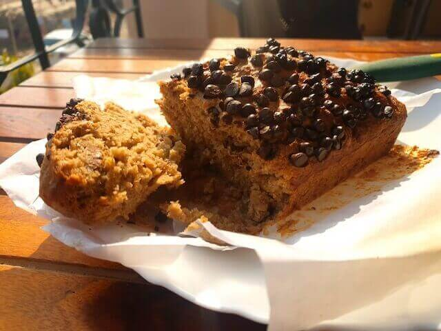

You need a Healthy cake to bake over the weekend, well something that pleasures your palate but spares you the guilt of cheating on your diet, well the Oats Walnut Banana Bread is your answer to all that.

 

The origins of this can be traced to Britain where the culture of high tea and afternoon tea among the aristocrats necessitated the chefs to formulate new and beautiful recipes, recipes that we enjoy till date.

 

This is a Diabetic friendly and a Diet friendly recipe and can be easily made within 30 to 40 minutes.

 

Even though it is essentially a Banana cake however it is rather called a Banana bread since it is comparatively denser than a cake.

 

Add walnuts to it and it becomes a BananaWalnut cake, other nuts like pecans, brazil nuts and raisins can also be added and all these variations are amazingly fresh and tasty.

 

It is an Eggless cake, hence it is both vegetarian and vegan friendly and is inclusive in all ways.

 

When you have overripe bananas ,this is an amazing way of using ripe bananas and the softer and sweeter the bananas the better the recipe turns out to be, it works with the natural sweetness of bananas.

 

It is a delightfully quick to make cake and if you are new to making desserts, you can go ahead and try this as it is a very easy cake for beginners.

 

The use of oat flour, replacing the usual all purpose flour makes this a beautifully healthy recipe, using almond flour is also an option, however I have found with my experiments that it makes the cake very very heavy and denser.

 

Be sure to make this over the next weekend when you wake up the inner chef in you.

 
 

|    Division  | Time    |
|--------------|---------|
| Prep Time    | 10 mins |
| Cook Time    | 30 mins |

 

Serves 2 to 4

 

{:title="Oats Walnut Banana Bread"}

 

**Ingredients**{: .heading1 }

 

|                       | Ingredient                 | Quantity                                 |
|-----------------------|----------------------------|------------------------------------------|
| &#10003; | Bananas                    | 2 to 3 ripe softened                     |
| &#10003; | Vanilla essence            | 1 teaspoon                               |
| &#10003; | Jaggery or saccharine      | 1/2 cup 100gms approx                    |
| &#10003; | Brown sugar (optional)     | 1/3 cup                                  |
| &#10003; | Oats flour                 | Flour of 150 gms oats                    |
| &#10003; | Baking powder              | 1/2 teaspoon                             |
| &#10003; | Baking Soda                | 1/2 teaspoon                             |
| &#10003; | Walnuts                    | Kernels of 4 to 6 walnuts                |
| &#10003; | Oil                        | 1 tbsp optional                          |
| &#10003; | Chocolate Chips or raisins | A handful                                |
| &#10003; | Butter paper               | To cover a rectangular 9 inch baking tin |

 

**Method**{: .heading1 }

**Step 1: Getting the Oats Walnut Banana Bread batter started**{: .heading2 }

- In a bowl take 100 gms of jaggery or sugar, skip it if you want all together or replace with sugar free as per your will and 50 gms brown sugaer
- Then add a teaspoon of vanilla extract
- Add in 2 to 3 ripe bananas
- Mash well with a spoon
- Next blend 150 gms of oats in a blender, add 1/2 teaspoon each of baking soda and baking powder to the blender before blending.

 
 

{:title="Oats Walnut Banana Bread"}

 
 

- Once the oats turn to a fine powder
- Add it to the banana mixture and mix very well

 
 

{:title="Making the Oat Flour"}

 
 

**Step 2: Adding the remaining ingredients of Oats Walnut Banana Bread**{: .heading2 }

- Now add 4 to 6 walnut kernels
- 1tbsp of oil ( optional)
- Set it aside for 3 to 5 mins.

 
 

{:title="Adding Walnuts"}

 
 

**Step 3: Getting ready to bake the  Oats Walnut Banana Bread**{: .heading2 }

- Line a rectangular pan with butter paper
- Pour in the batter 
- Cover with chocolate chips or raisins for a healthier option.
- Bake for 30 mins at 180 degrees

 
 

{:title="Baking Oats Walnut Banana Bread"}

 
 

I Love it right out of the oven.  
Tastes great when cooled too.  
However nothing ever remains for me to know how it tastes the next day.  

 

Enjoy

 
 

Here are few commonly asked questions about this recipe and I have tried my best to answer them for you

 

**Question 1: How to use over ripe bananas?**{: .heading2}  
Over ripe bananas are usually sweeter and softer and are therefore great for desserts in the form of banana bread or banana cake, milk shakes and caramalized bananas for pancakes, also it can be used in pancakes and waffle batter.

 
 

**Question 2: How to use nuts in cake?**{: .heading2}  
Nuts add an extra texture and crunch in cakes, enhance the flavour and cut on the sweetness hence it is great when added to cakes, nuts like walnuts and pecans compliment cakes the most, hazelnuts, cashews and brazil nuts can also be added.

 
 

**Question 3: Why is it called a banana bread and not a banana cake?**{: .heading2}  
Even though it is essentially a Banana cake however it is rather called a Banana bread since it is comparatively denser than a cake.

 
 

**Question 4: Is it an easy cake for beginners?**{: .heading2}  
It is a delightfully quick to make cake and if you are new to making desserts, you can go ahead and try this as it is a very easy cake for beginners.

 
 

**Question 5: What nuts can be used in cake?**{: .heading2}  
Walnuts and pecans compliment cakes the most, hazelnuts, cashews and brazil nuts can also be added. However pistachios are not that great in cakes.

 
 

**Question 6: What can be used if we do not want to use flour in cake?**{: .heading2}  
All purpose flour is not a very great option, so as a healthier option, oats flour, almond flour or rice flour can be used.

 
 

**Question 7: How do we make a cake without an oven?**{: .heading2}  
Well , you would be surprised to know, its rather easy to make a cake without an oven all you need is a heavy bottomed pan, lay the inside with sand or salt, place the baking tin over it and cover to form a mini oven, do not forget to preheat.

 
 

**Question 8: Can cake be made on an open fire during camping?**{: .heading2}  
Yes, the same method explained in no 8 can be followed, just make sure to monitor the temperature of the fire if you are using firewood.

 
 

**Question 9: What can be used as sugar substitute in cake?**{: .heading2}  
Jaggery, sevia  honey, saccharine are substitutes that are used in place of sugar.

 
 

**Question 10: What other fruit can be used instead of banana in making a cake?**{: .heading2}  
Well, pineapples, cherries, mangoes, apple puree, apricot puree, peaches all can be used to make cakes, however the level of sweetness have to be carefully balanced according to the taste of the fruit, hence it is advisable to taste a small piece of the fruit before blending or smashing it to be added to the batter.

 
 

Thank you for your support, follow us on <a href="https://www.facebook.com/travelBiryani/" title="Travel Biryani Facebook" target="_blank" rel='external nofollow'> Facebook </a>, <a href="https://www.instagram.com/travelBiryani/" title="Travel Biryani Instagram" target="_blank" rel='external nofollow'> Instagram </a>
and <a href="https://twitter.com/travelBiryani" title="Travel Biryani Twitter" target="_blank" rel='external nofollow'> Twitter </a> and please do NOT forget to share our recipes.