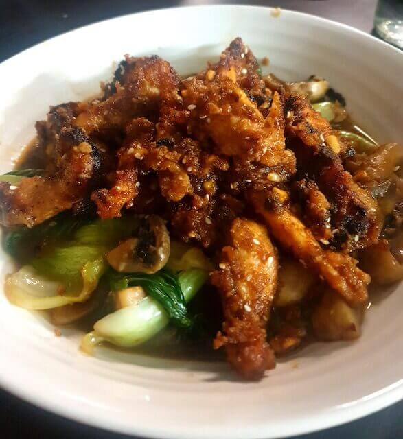
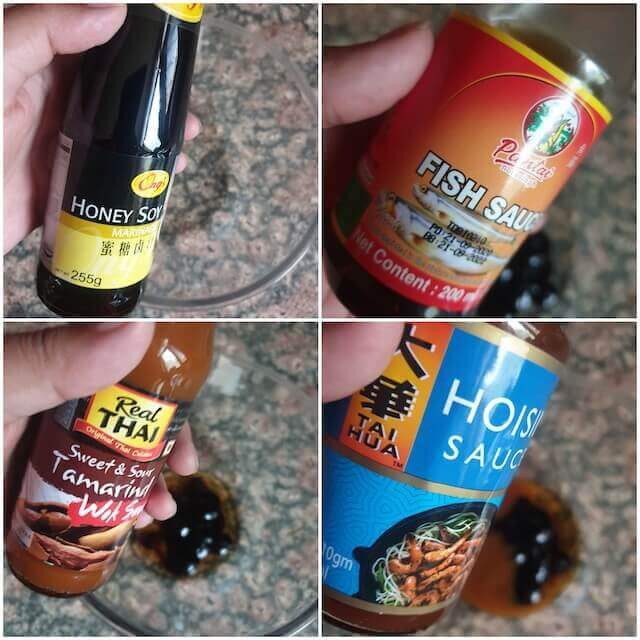
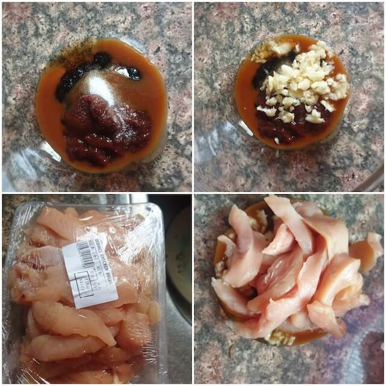
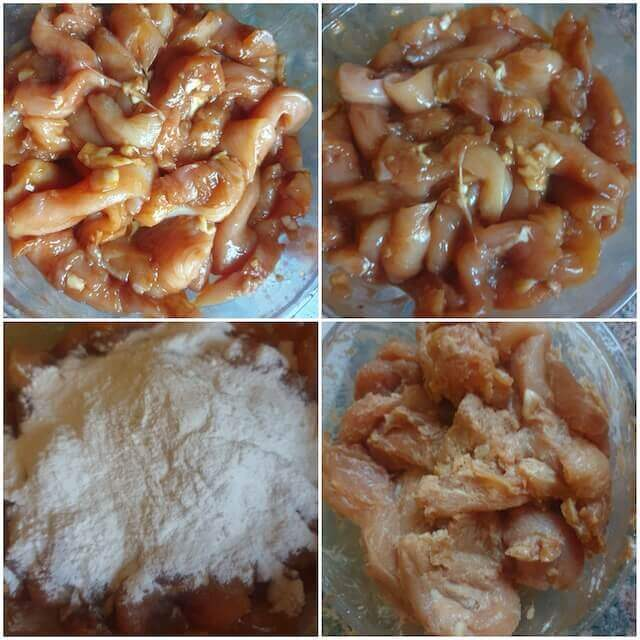
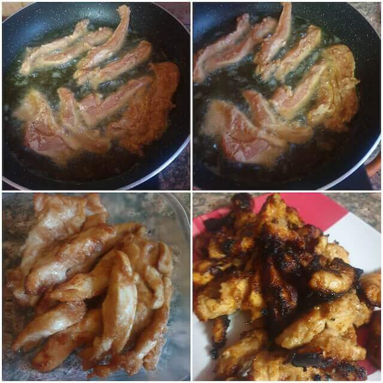
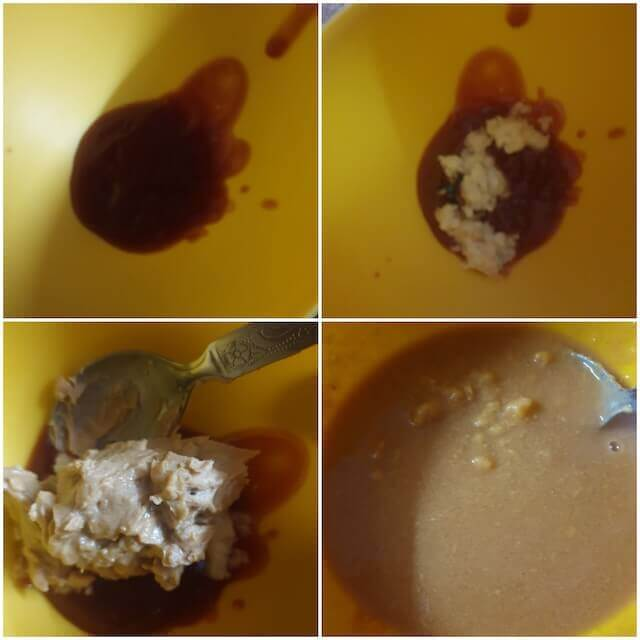
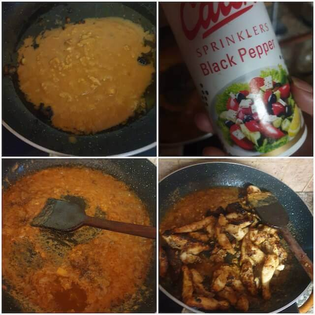
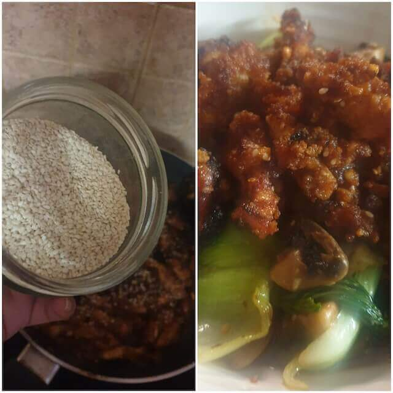

This Peanut Chicken Stir Fry is incredibly effortless to cook when the taste buds crave for a savoury-sweet delight with a tangy zing. It is Stir fry chicken with least ingredients

 

This recipe incorporates the goodness of a protein packed meal along with the mouth-watering combination of tastes and flavours that instantly explode in the mouth taking one to Food-Nirvana, a Chicken stir-fry for beginners

 

It can be whipped up in a matter of minutes with the most easily available ingredients in our kitchens.

 

It makes the perfect evening snack, post-workout protein diet, an easy go-to dinner or an appetizer in a lovely full course meal.

 

This Sweet and Sour Peanut Chicken Stir Fry will become an instant favourite in your home, loved by children and adults all the same.

 

You fulfil your protein requirement in one delicious meal in a matter of 20-30 minutes.

 

This dish is almost a complete meal in itself, hassle-free to make, healthy, and delicious- Definitely a complete Win-Win!

 
 

|    Division  | Time    |
|--------------|---------|
| Prep Time    | 30 mins |
| Cook Time    | 15 mins |

 

Serves 2 to 4

 

{:title="Peanut Chicken Stir Fry"}

 

**Ingredients**{: .heading1 }

 

|                       | Ingredient              | Quantity                    |
|-----------------------|-------------------------|-----------------------------|
| &#10003; | Chicken breast          | 1 kg, cut into thin strips  |
| &#10003; | Soy sauce               | 1 tablespoon                |
| &#10003; | Honey soy sauce         | 1 tablespoon                |
| &#10003; | Garlic cloves           | 10 to 12 cloves             |
| &#10003; | Hoisin sauce            | 1 tablespoon                |
| &#10003; | Tamarind sauce          | 1 tablespoon                |
| &#10003; | Salt                    | As per taste                |
| &#10003; | Fish sauce              | 1 tablespoon                |
| &#10003; | Red chilli powder       | 1 teaspoon                  |
| &#10003; | Corn flour              | 1/2 cup                     |
| &#10003; | Peanut butter           | 2 large scoops or 1/2 cup   |
| &#10003; | Sugar                   | 1/2 teaspoon                |
| &#10003; | Ketchup                 | 3 tablespoons               |
| &#10003; | Black pepper            | 1 teaspoon                  |
| &#10003; | Oil                     | 3 tablespoon                |
| &#10003; | Lemon                   | 1/2 teaspoon                |
| &#10003; | Sesame seeds            | 1 tablespoons               |
| &#10003; | Chicken or fish masala  | 1/2 tablespoon              |

 

**Method**{: .heading1 }

**Step 1: Starting the marination sauce.**{: .heading2 }

In a bowl
- Add 1 tablespoon of soy sauce, use honey soy if available , if not add soy sauce with half a teaspoon of sugar.
- 1 tablespoon of fish sauce
- 1 tablespoon of tamarind extract
- 1 tablespoon of hoisin sauce
- Salt as per taste
- Chicken masala

 
 

{:title="Starting the marination"}

 
 

**Step 2: Marinating the chicken**{: .heading2 }

- Mix the ingredients well
- Add 8 to 9 cloves of garlic, chopped well
- Wash and add the chicken pieces.
- Chicken breast cut into thin pieces gives the best result.
- Mix well and leave for 15 mins (optional)

 
 

{:title="Marinating the chicken"}

 
 

**Step 3: Adding Cornflour**{: .heading2 }

Once the marination is done, add half a cup of cornflour and coat the chicken pieces thoroughly in it.

 
 

{:title="Adding Cornflour"}

 
 

**Step 4: Frying the chicken**{: .heading2 }

- Shallow fry the chicken in the oil of your choice and set aside to rest.
- Do not overcrowd the pan
- Fry for 3 mins on each side.
- Double fry for increased crispiness.
- Pro tip - you can also make this in large batches and freeze this for upto a month.

 
 

{:title="Frying the chicken"}

 
 

**Step 5: Starting the peanut sauce**{: .heading2 }

In a bowl combine
- 3 tablespoons of ketchup
- 3 to 4 chopped cloves of garlic
- 2 large scoops of peanut butter ( unsweetened)
- Add half cup of water and combine well.

 
 

{:title="Starting the peanut sauce"}

 
 

**Step 6: Making the sauce**{: .heading2 }

- In the same pan , add the sauce and stir well on a high flame.
- Add black pepper 1 teaspoon and salt to taste.
- Mix the chicken pieces 

 
 

{:title="Making the sauce"}

 
 

**Step 7: Sprinkle sesame seeds and toss in with lemon juice**{: .heading2 }

And serve hot.

 
 

{:title="Final Garnishing"}

 
 

Here are few commonly asked questions about this recipe and I have tried my best to answer them for you

 

**Question 1: How to use breast of chicken?**{: .heading2}  
Chicken Breast can be used easily in this recipe as it is boneless, easy to cut up into bite-sized pieces and is 100% protein.

 
 

**Question 2: Do peanuts go well with chicken?**{: .heading2}  
Peanuts go amazingly well with chicken. All Asian Cuisines, especially Thai Cuisine is particularly rich in peanuts which add a crunchy bite to the dish and a certain diverse flavour.

 
 

**Question 3: How to use peanut butter with chicken?**{: .heading2}  
Unsweetened peanut butter can be added as an ingredient to many Asian dishes as it provides a rich and creamy texture to the dish. It is highly nutritious and healthy making it a best dish add-on for fitness freaks and gym bugs.

 
 

**Question 4: Does a combination of peanut butter and chicken work?**{: .heading2}  
The combination of peanut butter and chicken as strange as it may sound, works wonder. While the chicken adds a soft, tender bite to the dish the peanut butter adds a creamy texture and wonderful mildly -savoury, nutty tasting flavour.

 
 

**Question 5: Is it good to eat proteins for weight loss?**{: .heading2}  
Yes, proteins can prove to be beneficial in order to lose as well as gain weight. Protein is an essential nutrient for weight loss and achieving a fit body. Consuming the right amount of proteins help in making positive changes in the weight-regulating hormones of our body. Proteins provide more nutrition in a small amount meaning one has to consume less to fulfil the nutrient requirement thus reducing appetite and increasing the body's metabolism.

 
 

**Question 6: How to get the maximum flavour out of chicken?**{: .heading2}  
Chicken in itself is very easy to make and full of flavours. The different parts of chicken lay out different tastes, thus providing a diverse range of flavours. The flavours of chicken can be further enhanced by clubbing it with different spices and ingredients such as garlic, peppers, cardamom, cloves, cinnamon, bay leaves, star anise, nut-meg etc. Perfectly-timed and even marination as well as a salt and sugar rub can drastically enhance the taste and bring out the flavours of chicken.

 
 

**Question 7: Is this dish healthy?**{: .heading2}  
This dish is super healthy as it is fully packed with protein. The amount of chicken used in this meal fulfils the average protein requirement of the body and the goodness of peanut delivers the essential supply of unsaturated fatty-acids. It is heaven-in-a-bowl for the health conscious due to its nutritional value with an added bonus of extreme deliciousness. 

 
 

**Question 8: Can I eat it when on a diet?**{: .heading2}  
When following a diet, this dish is best suited to be consumed post-workout as that is when the body requires maximum protein to recover the torn muscle-fibres induced during workout. It restores the muscle elasticity and energy spent during workout. It is the perfect, hearty meal after an intense workout session. It can also be consumed as a pre-workout meal to provide energy to exercise, but in a limited amount so as not to feel heavy or bloated during workout.

 
 

**Question 9: Can this be eaten during pregnancy?**{: .heading2}  
 In most cases, this dish is safe to be consumed during pregnancy and lactation. However, many individuals may have allergic reactions to certain ingredients in this dish such as Peanuts. Therefore, it is recommended to check up for any allergic reactions before consuming this meal, especially if you are pregnant or breast-feeding.

 
 

**Question 10: What are the nutrients in this recipe?**{: .heading2}  
The main nutrients in this recipe are proteins and fats. The lean chicken breast is rich in proteins, essential amino acids, healthy fats and fibre. The addition of peanuts provide the goodness and nutrition of unsaturated-fatty acids and certain micro-nutrients which are essential for the body.

 
 

Thank you for your support, follow us on <a href="https://www.facebook.com/travelBiryani/" title="Travel Biryani Facebook" target="_blank" rel='external nofollow'> Facebook </a>, <a href="https://www.instagram.com/travelBiryani/" title="Travel Biryani Instagram" target="_blank" rel='external nofollow'> Instagram </a>
and <a href="https://twitter.com/travelBiryani" title="Travel Biryani Twitter" target="_blank" rel='external nofollow'> Twitter </a> and please do NOT forget to share our recipes.