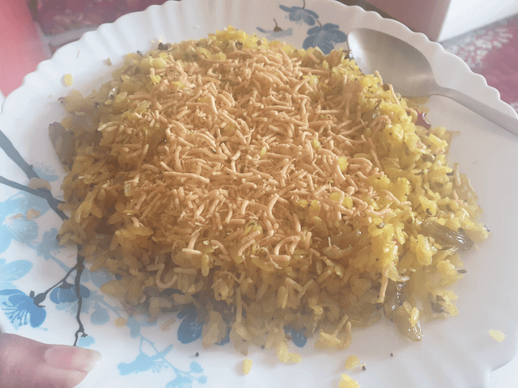
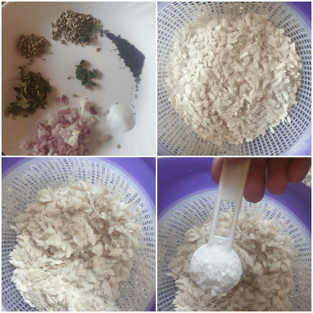
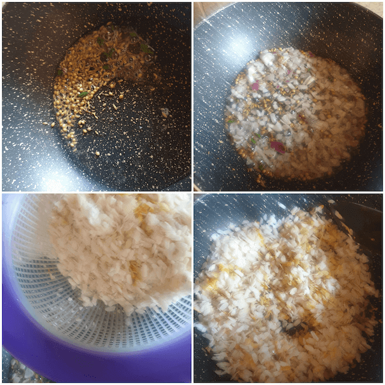
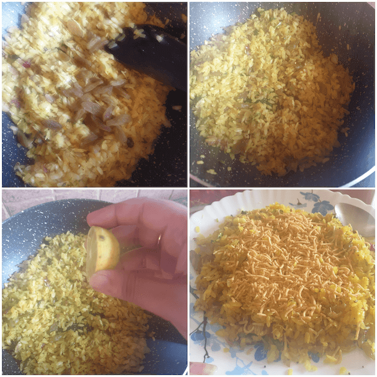

Poha, one of the most important and wholesome breakfast option all over India is actually a combination of flattened rice or poha with a variety of spices and veggies. The word "Poha" refers to flattened rice. It is a signature snack cooked in a variety of ways in a diverse range of cultures. 

 

Poha can be prepared in a variety of  mouth-watering tastes and flavours- tangy, sweet, savoury, and spicy. It is a simple yet sophisticated dish, appealing to the taste buds and invigorating the senses. 

 

It is often the go to dish when guests unexpectedly pay a visit as it is simple, quick and hassle-free to prepare. The perfect breakfast choice or a mid day munchie or a chai time snack, Poha fits in all the meals well as it is light yet filling and mind-blowingly delicious.

 
 

|    Division  | Time   |
|--------------|--------|
| Prep Time    | 5 mins |
| Cook Time    | 5 mins |

 

Serves 2 (an approximate serving of 125gms)

 

{:title="Indori Poha"}

 

**Ingredients**{: .heading1 }

 

|                       | Ingredient      | Quantity              |
|-----------------------|-----------------|-----------------------|
| &#10003; | Fennel seeds    | 1/2 teaspoon          |
| &#10003; | Mustard seeds   | 1/2 teaspoon          |
| &#10003; | Green chilli    | 1 to 2 finely chopped |
| &#10003; | Coriander seeds | 1/3teaspoon           |
| &#10003; | Poha            | 250 gms               |
| &#10003; | Turmeric powder | 1/2 teaspoon          |
| &#10003; | Salt            | As per taste          |
| &#10003; | Sugar           | 1/2 teaspoon          |

 

**Method**{: .heading1 }

**Step 1: Getting the ingredients ready for Indori Poha**{: .heading2 }
- Finely chop the onions, coriander leaves, green chillies
- Keep the coriander seeds, fennel leaves, salt ,mustard seeds ready
- Wash the flattened rice in a collander and keep it aside to drain the water.
- Add turmeric powder and sugar to the washed flattened rice once the water drains   

 

Getting the ingredients ready

 
 

{:title="Indori Poha Ingredients"}

 
 

Adding the turmeric.

 
 

{:title="Indori Poha Ingredients"}

 
 

**Step 2: Starting the preparation for Indori Poha**{: .heading2 }

- Heat a pan and add oil to it
- Add the fennel seeds, mustard seeds and coriander seeds to it and let them splutter
- Add the onions and sauté them for 2 minutes until they soften.
- Now add the chopped green chillies
- Then add the flattened rice and mix well
- Add salt to taste.

 

Adding the main ingredients

 
 

{:title="Indori Poha Main Ingredients"}

 
 

**Step 3: Final touches for Indori Poha**{: .heading2 }

- Mix the poha over low heat very well for 3 minutes
- Add a few raisins if you like
- Turn off the heat and add chopped coriander leaves and squeeze half a lemon and add
- Garnish with sev and its ready to be served hot.

 

Garnishing 

 
 

{:title="Indori Poha Final Touches"}

 
 

Your poha is ready to eat with a hot cup of tea

 
 

Here are few commonly asked questions about this recipe and I have tried my best to answer them for you

 

**Question 1: How to use flattened rice as breakfast?**{: .heading2}  
Flattened rice is an amazing breakfast alternative, eaten all around north india , known as poha.

 
 

**Question 2: Is flattened rice a healthy breakfast alternative?**{: .heading2}  
Low on oil and packed with carbs and proteins, it provides energy to go through the day.

 
 

**Question 3: Why does my poha become soggy?**{: .heading2}  
If you do not drain the water well from the poha after rinsing it, it will become soggy, so the secret is to dry off the water well after soaking it.

 
 

**Question 4: Can vegetables be added to poha?**{: .heading2}  
Yes there are several variations of poha where potatoes and other veggies are added to the poha, I will soon put up a recipe for the same.

 
 

**Question 5: Can eggs or chicken be added to poha?**{: .heading2}  
Yes eggs and chicken can both be added to the poha, we will put up the recipe soon.

 
 

**Question 6: Can nuts be added to poha?**{: .heading2}  
Yes peanuts, cashews, walnuts can all be added to poha recipe.

 
 

Thank you for your support, follow us on <a href="https://www.facebook.com/travelBiryani/" title="Travel Biryani Facebook" target="_blank" rel='external nofollow'> Facebook </a>, <a href="https://www.instagram.com/travelBiryani/" title="Travel Biryani Instagram" target="_blank" rel='external nofollow'> Instagram </a>
and <a href="https://twitter.com/travelBiryani" title="Travel Biryani Twitter" target="_blank" rel='external nofollow'> Twitter </a> and please do NOT forget to share our recipes.